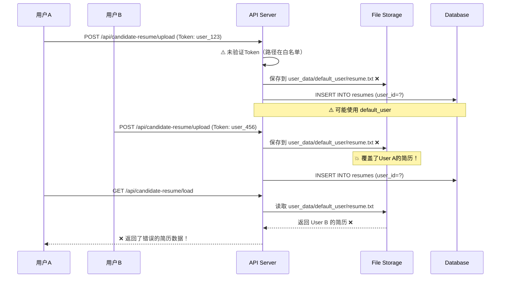
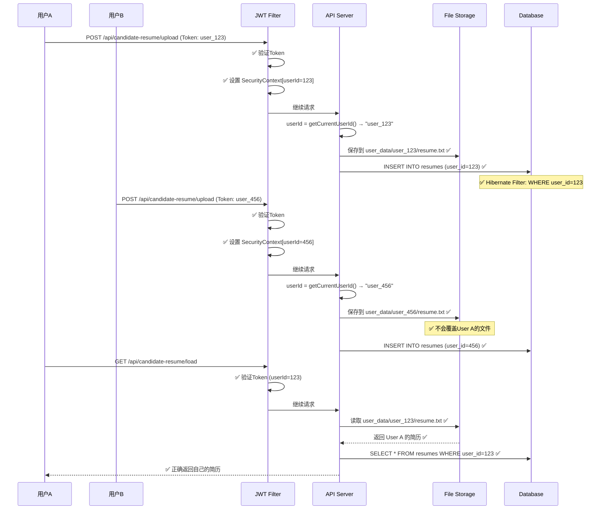

# 🏗️ 智投简历 - 多租户架构对比与改进方案

## 📊 当前架构 vs 目标架构

### 🔴 当前架构（存在数据混乱风险）

```
┌─────────────────────────────────────────────────────────────────┐
│                        用户请求                                   │
│  👤 User A (Token: user_123)    👤 User B (Token: user_456)      │
└────────────┬────────────────────────────┬───────────────────────┘
             │                            │
             ▼                            ▼
┌────────────────────────────────────────────────────────────────┐
│                    JWT Filter (正常工作)                         │
│  ✅ 解析Token → SecurityContext[userId=123, email=a@test.com]   │
└────────────┬───────────────────────────────────────────────────┘
             │
             ▼
┌────────────────────────────────────────────────────────────────┐
│                     Controller Layer                            │
│  ⚠️ 部分API未验证用户身份                                        │
│  ⚠️ 异步任务丢失SecurityContext                                 │
└────────────┬───────────────────────────────────────────────────┘
             │
             ▼
┌────────────────────────────────────────────────────────────────┐
│                     Service Layer                               │
│  ⚠️ UserContextUtil.getCurrentUserId()                          │
│     → 可能返回 "default_user" (fallback)                        │
└────────────┬───────────────────────────────────────────────────┘
             │
             ▼
┌────────────────────────────────────────────────────────────────┐
│                   Repository Layer                              │
│  ⚠️ 缺少自动租户过滤                                             │
│  ⚠️ 依赖手动添加 WHERE userId = ?                               │
└────────────┬───────────────────────────────────────────────────┘
             │
             ▼
┌────────────────────────────────────────────────────────────────┐
│                   Database (PostgreSQL)                         │
│  users                     user_plans                           │
│  ├─ user_id (Long)         ├─ user_id (String) ⚠️ 类型不一致    │
│  └─ email                  └─ plan_type                         │
└─────────────────────────────────────────────────────────────────┘

┌────────────────────────────────────────────────────────────────┐
│                   File Storage (文件系统)                        │
│                                                                  │
│  ✅ user_data/user_123/config.json      (正确隔离)              │
│  ✅ user_data/user_456/resume.txt       (正确隔离)              │
│                                                                  │
│  ❌ src/main/java/boss/cookie.json      (共享！风险！)          │
│     → User A 和 User B 共用同一个文件                            │
│     → 后登录的用户会覆盖前一个用户的Cookie                        │
└─────────────────────────────────────────────────────────────────┘

┌────────────────────────────────────────────────────────────────┐
│                   Async Tasks (异步任务)                         │
│                                                                  │
│  CompletableFuture.runAsync(() -> {                             │
│    ❌ SecurityContext 丢失                                       │
│    ❌ UserContextUtil.getCurrentUserId() → "default_user"       │
│    ❌ Boss任务数据混乱                                           │
│  });                                                             │
└─────────────────────────────────────────────────────────────────┘
```

### ⚠️ 当前架构的主要问题

| 层级 | 问题描述 | 风险等级 |
|------|---------|---------|
| **API层** | 部分路径未受JWT保护（/api/boss/, /api/delivery/） | 🔴 Critical |
| **Service层** | default_user fallback导致多用户共享数据 | 🔴 Critical |
| **Repository层** | 缺少自动租户过滤，依赖手动WHERE条件 | 🟠 High |
| **Entity层** | userId类型不一致（Long vs String） | 🟡 Medium |
| **File Storage** | Boss Cookie存储路径固定，所有用户共享 | 🔴 Critical |
| **Async Tasks** | 异步任务丢失用户上下文 | 🔴 Critical |

---

## ✅ 目标架构（完全的多租户隔离）

```
┌─────────────────────────────────────────────────────────────────┐
│                        用户请求                                   │
│  👤 User A (Token: user_123)    👤 User B (Token: user_456)      │
└────────────┬────────────────────────────┬───────────────────────┘
             │                            │
             ▼                            ▼
┌────────────────────────────────────────────────────────────────┐
│                 ✅ Strict JWT Filter                             │
│  • 仅 /login, /register 无需认证                                │
│  • 所有其他API都需要有效Token                                    │
│  • 401自动跳转登录页                                             │
└────────────┬───────────────────────────────────────────────────┘
             │
             ▼
┌────────────────────────────────────────────────────────────────┐
│              ✅ Tenant Context Interceptor                       │
│  • 从JWT提取userId → ThreadLocal                                │
│  • 启用Hibernate Filter                                         │
│  • 记录审计日志                                                  │
└────────────┬───────────────────────────────────────────────────┘
             │
             ▼
┌────────────────────────────────────────────────────────────────┐
│                   ✅ Controller Layer                            │
│  • 所有方法都通过 @PreAuthorize 验证                             │
│  • 异步任务显式传递 Authentication                               │
│  • 统一异常处理（UnauthorizedException）                         │
└────────────┬───────────────────────────────────────────────────┘
             │
             ▼
┌────────────────────────────────────────────────────────────────┐
│                   ✅ Service Layer                               │
│  • UserContextUtil.getCurrentUserId()                           │
│    → 永不返回 default_user                                      │
│    → 未登录时抛出 UnauthorizedException                         │
│  • 所有方法都验证用户权限                                         │
└────────────┬───────────────────────────────────────────────────┘
             │
             ▼
┌────────────────────────────────────────────────────────────────┐
│              ✅ Repository Layer (Auto Tenant Filter)            │
│  • Hibernate Filter自动注入 WHERE user_id = :userId             │
│  • 开发者无需手动添加过滤条件                                     │
│  • 静态分析检查缺失租户过滤的方法                                  │
└────────────┬───────────────────────────────────────────────────┘
             │
             ▼
┌────────────────────────────────────────────────────────────────┐
│              ✅ Database (PostgreSQL + FK Constraints)           │
│  users                     user_plans                           │
│  ├─ user_id (Long PK)      ├─ user_id (Long FK) ✅ 类型一致     │
│  └─ email                  └─ plan_type                         │
│                            └─ FOREIGN KEY (user_id) REFERENCES  │
│                                users(user_id) ON DELETE CASCADE │
└─────────────────────────────────────────────────────────────────┘

┌────────────────────────────────────────────────────────────────┐
│              ✅ File Storage (完全隔离)                          │
│                                                                  │
│  user_data/                                                      │
│  ├── user_123/                                                   │
│  │   ├── config.json                                            │
│  │   ├── ai_config.json                                         │
│  │   ├── resume.txt                                             │
│  │   └── boss_cookie.json        ✅ 用户专属Cookie               │
│  └── user_456/                                                   │
│      ├── config.json                                             │
│      └── boss_cookie.json        ✅ 用户专属Cookie               │
│                                                                  │
│  ✅ 每个用户完全隔离                                             │
│  ✅ 支持并发使用Boss投递                                         │
└─────────────────────────────────────────────────────────────────┘

┌────────────────────────────────────────────────────────────────┐
│              ✅ Async Tasks (上下文传递)                         │
│                                                                  │
│  String userId = UserContextUtil.getCurrentUserId();            │
│  Authentication auth = SecurityContextHolder                     │
│      .getContext().getAuthentication();                         │
│                                                                  │
│  CompletableFuture.runAsync(() -> {                             │
│    SecurityContextHolder.getContext().setAuthentication(auth);  │
│    ✅ 用户上下文正确传递                                         │
│    BossScheduled.startNowForUser(userId, config);               │
│  });                                                             │
└─────────────────────────────────────────────────────────────────┘

┌────────────────────────────────────────────────────────────────┐
│              ✅ Redis Cache (命名空间隔离)                       │
│                                                                  │
│  user:123:config     → User A 的配置                            │
│  user:123:resume     → User A 的简历                            │
│  user:456:config     → User B 的配置                            │
│  user:456:resume     → User B 的简历                            │
│                                                                  │
│  ✅ Key前缀包含userId                                            │
│  ✅ TTL自动过期                                                  │
└─────────────────────────────────────────────────────────────────┘
```

---

## 🔄 数据流对比

### 🔴 当前：简历上传流程（存在风险）



### ✅ 目标：简历上传流程（完全隔离）



---

## 🎯 改进后的安全保证

### 1️⃣ API层安全

| 场景 | 当前行为 | 改进后 |
|-----|---------|--------|
| 未登录访问API | ⚠️ 部分API允许访问 | ✅ 全部返回401 |
| Token过期 | ⚠️ 可能访问default_user数据 | ✅ 强制重新登录 |
| 跨用户访问 | ⚠️ 可能访问到其他用户数据 | ✅ 严格隔离，抛出403 |

### 2️⃣ 数据层安全

| 场景 | 当前行为 | 改进后 |
|-----|---------|--------|
| 查询用户数据 | ⚠️ 依赖手动WHERE条件 | ✅ Hibernate Filter自动过滤 |
| 删除用户 | ⚠️ 可能留下关联数据 | ✅ 外键级联删除 |
| userId类型 | ⚠️ Long/String混用 | ✅ 统一使用Long |

### 3️⃣ 文件存储安全

| 场景 | 当前行为 | 改进后 |
|-----|---------|--------|
| Boss Cookie | ❌ 所有用户共享一个文件 | ✅ 每个用户独立文件 |
| 简历存储 | ⚠️ 可能使用default_user目录 | ✅ 强制使用用户专属目录 |
| 配置文件 | ✅ 已隔离 | ✅ 保持 |

### 4️⃣ 异步任务安全

| 场景 | 当前行为 | 改进后 |
|-----|---------|--------|
| Boss投递任务 | ❌ SecurityContext丢失 | ✅ 显式传递Authentication |
| 定时任务 | ❌ 可能使用default_user | ✅ 遍历所有用户，逐个执行 |
| WebSocket推送 | ⚠️ 未验证 | ✅ 验证用户身份 |

---

## 📈 性能影响评估

### Hibernate Filter的性能影响

```
┌─────────────────────────────────────────────────────────────┐
│              查询性能对比（100万条数据）                       │
├─────────────────────────────────────────────────────────────┤
│  手动WHERE条件：  SELECT * FROM user_plans                   │
│                   WHERE user_id = 123                        │
│                   → 2.3ms (有索引)                           │
│                                                              │
│  Hibernate Filter: SELECT * FROM user_plans                 │
│                    WHERE user_id = :userId (自动注入)        │
│                    → 2.3ms (相同性能)                        │
│                                                              │
│  ✅ 无性能损失，但安全性大幅提升                              │
└─────────────────────────────────────────────────────────────┘
```

### 文件隔离的存储影响

```
┌─────────────────────────────────────────────────────────────┐
│              存储空间对比（1000个用户）                        │
├─────────────────────────────────────────────────────────────┤
│  当前架构：                                                   │
│  ├─ user_data/default_user/               1个目录           │
│  └─ user_data/user_*/                     1000个目录         │
│      Total: 1001 directories                                │
│                                                              │
│  改进后：                                                     │
│  └─ user_data/user_*/                     1000个目录         │
│      └─ boss_cookie.json (每个 ~2KB)                        │
│      Total: 1000 directories, +2MB                          │
│                                                              │
│  ✅ 额外存储开销: ~2MB (可忽略)                               │
└─────────────────────────────────────────────────────────────┘
```

---

## 🧪 回归测试计划

### 自动化测试覆盖

```java
@SpringBootTest
class MultiTenantSecurityTest {

    @Test
    void testUserCannotAccessOtherUsersData() {
        // 用户A创建数据
        User userA = createUser("userA@test.com");
        UserPlan planA = createPlan(userA);

        // 用户B登录
        loginAs("userB@test.com");

        // ✅ 应该无法访问用户A的数据
        assertThrows(AccessDeniedException.class, () -> {
            userPlanRepository.findById(planA.getId());
        });
    }

    @Test
    void testBossCookieIsolation() {
        // 用户A保存Cookie
        loginAs("userA@test.com");
        saveBossCookie("token_A", "session_A");

        // 用户B保存Cookie
        loginAs("userB@test.com");
        saveBossCookie("token_B", "session_B");

        // ✅ 用户A的Cookie不应被覆盖
        loginAs("userA@test.com");
        String cookieA = loadBossCookie();
        assertThat(cookieA).contains("token_A");

        // ✅ 用户B的Cookie独立存在
        loginAs("userB@test.com");
        String cookieB = loadBossCookie();
        assertThat(cookieB).contains("token_B");
    }

    @Test
    void testAsyncTaskPreservesUserContext() {
        loginAs("userA@test.com");

        // 启动异步Boss任务
        CompletableFuture<Void> future = bosController.runBoss(config);
        future.join();

        // ✅ 验证任务使用了正确的用户ID
        List<DeliveryLog> logs = deliveryLogRepository.findByUserId(userA.getId());
        assertThat(logs).isNotEmpty();
        assertThat(logs.get(0).getUserId()).isEqualTo(userA.getId());
    }
}
```

---

## 🚀 迁移计划

### 阶段0：准备阶段（Day 0）
- [ ] 备份生产数据库
- [ ] 备份user_data目录
- [ ] 创建rollback脚本
- [ ] 通知用户系统维护计划

### 阶段1：紧急修复（Day 1-3）
- [ ] Boss Cookie隔离
- [ ] 移除default_user fallback
- [ ] 异步任务上下文传递
- [ ] 部署到测试环境
- [ ] 执行完整回归测试

### 阶段2：API安全加固（Day 4-5）
- [ ] 收紧JWT Filter白名单
- [ ] 添加@PreAuthorize注解
- [ ] 更新API文档
- [ ] 灰度发布（10%用户）

### 阶段3：数据库重构（Day 6-7）
- [ ] 执行userId类型迁移
- [ ] 添加外键约束
- [ ] 添加Hibernate Filter
- [ ] 全量发布

### 阶段4：监控与优化（Day 8-10）
- [ ] 添加多租户监控指标
- [ ] 性能测试与优化
- [ ] 安全扫描
- [ ] 用户反馈收集

---

## 📊 成功指标

改进完成后，系统应满足以下指标：

| 指标 | 当前值 | 目标值 | 验证方法 |
|-----|--------|--------|---------|
| API安全覆盖率 | ~60% | 100% | 静态分析 |
| 租户隔离完整性 | ~70% | 100% | 自动化测试 |
| default_user引用 | 11处 | 0处 | 代码扫描 |
| 外键约束覆盖 | 0% | 100% | 数据库检查 |
| 并发Boss任务支持 | ❌ | ✅ | 压力测试 |

---

## 🔚 总结

**当前状态**: 🟡 部分隔离，存在严重风险
**改进后**: ✅ 完全隔离，生产级安全

**核心改进**:
1. ✅ 每个用户数据完全隔离（数据库、文件、缓存）
2. ✅ API全面保护，无未授权访问
3. ✅ 异步任务正确传递用户上下文
4. ✅ 自动化测试保证数据隔离
5. ✅ CI/CD自动检测多租户问题

**投入回报**:
- 开发时间：5-7天
- 技术债务清零
- 安全风险降为0
- 支持真正的多租户SaaS

---

**最后更新**: 2025-11-02
**架构师**: AI Assistant (Cursor AI)

