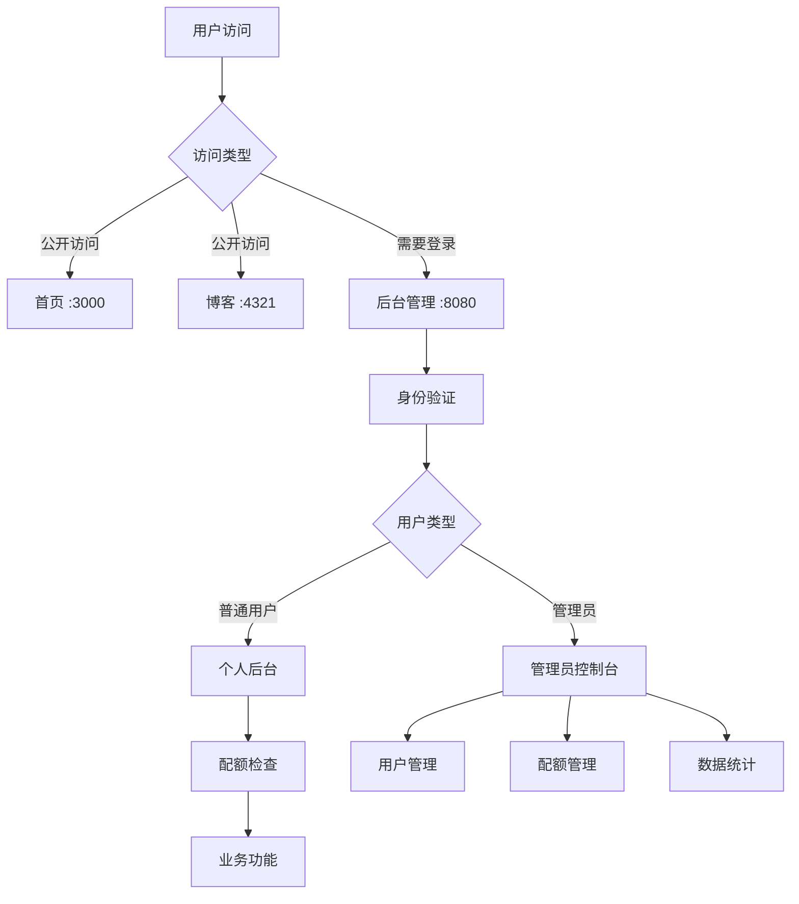

# 智投简历平台配额管理系统 - 用户使用指南

## 📖 文档概述

本文档详细介绍智投简历平台商业化配额管理系统的使用方法、API接口、管理员操作指南以及技术实现细节。

---

## 🎯 系统概述

### 系统定位
智投简历是专为**个人求职者**设计的智能化求职平台，提供简历生成、AI优化、智能投递等服务。

### 核心功能
- **三层访问控制** - 首页、博客、后台管理的分级访问
- **细分配额管理** - 13种配额类型的精细化控制
- **管理员后台** - 类似OSS的强大管理功能
- **商业化支持** - 4个套餐等级的灵活定价

---

## 🏗️ 系统架构



---

## 🚀 快速开始

### 1. 系统启动

```bash
# 启动后端服务 (端口 8080)
cd /Users/user/autoresume/get_jobs
mvn clean package -DskipTests
java -jar target/get_jobs-v2.0.1.jar

# 启动前端服务 (端口 3000)
cd /Users/user/autoresume
npm start

# 启动博客服务 (端口 4321) 
cd /Users/user/autoresume/zhitoujianli-blog
npm run dev
```

### 2. 访问地址

| 服务 | 地址 | 说明 |
|------|------|------|
| 首页 | http://localhost:3000 | 公开访问，无需登录 |
| 博客 | http://localhost:4321/blog | 公开访问，无需登录 |
| 后台管理 | http://localhost:8080 | 需要登录，自动重定向认证 |

### 3. 默认管理员账户

系统预设超级管理员用户ID：`68dba0e3d9c27ebb0d93aa42`
- 该用户在Authing中认证后将自动获得超级管理员权限
- 可以创建和管理其他平台管理员

---

## 👥 用户角色和权限

### 用户层级

```
智投简历平台
├── 超级管理员 (Super Admin)
│   └── 最高权限，管理所有功能
├── 平台管理员 (Platform Admin)
│   └── 日常运营管理权限
└── 个人用户 (Individual Users)
    ├── 免费版 (Free Tier)
    ├── 基础版 (Basic Plan) - ¥29/月
    ├── 专业版 (Professional Plan) - ¥99/月
    └── 旗舰版 (Enterprise Plan) - ¥299/月
```

### 权限对比表

| 功能 | 普通用户 | 平台管理员 | 超级管理员 |
|------|----------|------------|------------|
| 个人简历管理 | ✅ | ✅ | ✅ |
| AI服务使用 | ✅ (有配额) | ✅ | ✅ |
| 查看用户列表 | ❌ | ✅ | ✅ |
| 修改用户套餐 | ❌ | ✅ | ✅ |
| 重置用户配额 | ❌ | ✅ | ✅ |
| 创建管理员 | ❌ | ❌ | ✅ |
| 系统配置 | ❌ | ❌ | ✅ |

---

## 📊 配额管理详解

### 配额类别

#### 1. 简历相关配额

| 配额键 | 配额名称 | 单位 | 重置周期 | 说明 |
|--------|----------|------|----------|------|
| `resume_templates` | 简历模板数量 | 个 | 永不重置 | 可使用的模板总数 |
| `resume_create` | 可创建简历数量 | 个 | 永不重置 | 可创建的简历总数 |
| `resume_export_monthly` | 简历导出次数 | 次 | 每月重置 | 月度导出限制 |

#### 2. AI服务配额

| 配额键 | 配额名称 | 单位 | 重置周期 | 说明 |
|--------|----------|------|----------|------|
| `ai_resume_optimize_monthly` | AI简历优化 | 次 | 每月重置 | 月度AI优化次数 |
| `ai_greeting_generate_monthly` | AI打招呼生成 | 次 | 每月重置 | 月度打招呼生成 |
| `ai_interview_practice_monthly` | AI面试练习 | 次 | 每月重置 | 月度面试练习 |
| `ai_job_matching_monthly` | AI职位匹配 | 次 | 每月重置 | 月度职位匹配 |

#### 3. 投递功能配额

| 配额键 | 配额名称 | 单位 | 重置周期 | 说明 |
|--------|----------|------|----------|------|
| `auto_delivery_daily` | 自动投递 | 次 | 每日重置 | 日度自动投递次数 |

#### 4. 存储数据配额

| 配额键 | 配额名称 | 单位 | 重置周期 | 说明 |
|--------|----------|------|----------|------|
| `storage_space` | 存储空间 | MB | 永不重置 | 总存储空间限制 |
| `resume_versions` | 简历版本历史 | 个 | 永不重置 | 版本历史保存数量 |
| `file_upload_size` | 文件上传大小 | MB | 永不重置 | 单文件上传限制 |

#### 5. 高级功能配额

| 配额键 | 配额名称 | 单位 | 重置周期 | 说明 |
|--------|----------|------|----------|------|
| `custom_ai_prompts` | 自定义AI提示词 | 个 | 永不重置 | 是否支持自定义 |
| `advanced_analytics` | 高级数据分析 | 个 | 永不重置 | 是否支持高级分析 |

### 套餐配额限制

#### 免费版 (Free)

| 配额类型 | 限制 |
|----------|------|
| 简历模板数量 | 3 |
| 可创建简历数量 | 1 |
| 简历导出次数/月 | 5 |
| AI简历优化/月 | 3 |
| AI打招呼生成/月 | 5 |
| AI面试练习/月 | 0 |
| AI职位匹配/月 | 3 |
| 自动投递/日 | 0 |
| 存储空间 | 100MB |
| 简历版本历史 | 3个 |
| 文件上传限制 | 5MB |
| 自定义AI提示词 | ❌ |
| 高级数据分析 | ❌ |

#### 基础版 (Basic) - ¥29/月

| 配额类型 | 限制 |
|----------|------|
| 简历模板数量 | 10 |
| 可创建简历数量 | 5 |
| 简历导出次数/月 | 50 |
| AI简历优化/月 | 20 |
| AI打招呼生成/月 | 50 |
| AI面试练习/月 | 10 |
| AI职位匹配/月 | 20 |
| 自动投递/日 | 5 |
| 存储空间 | 1GB |
| 简历版本历史 | 10个 |
| 文件上传限制 | 20MB |
| 自定义AI提示词 | ❌ |
| 高级数据分析 | 基础 |

#### 专业版 (Professional) - ¥99/月

| 配额类型 | 限制 |
|----------|------|
| 简历模板数量 | 50 |
| 可创建简历数量 | 20 |
| 简历导出次数/月 | 200 |
| AI简历优化/月 | 100 |
| AI打招呼生成/月 | 200 |
| AI面试练习/月 | 50 |
| AI职位匹配/月 | 100 |
| 自动投递/日 | 20 |
| 存储空间 | 5GB |
| 简历版本历史 | 50个 |
| 文件上传限制 | 50MB |
| 自定义AI提示词 | ✅ |
| 高级数据分析 | 详细 |

#### 旗舰版 (Enterprise) - ¥299/月

| 配额类型 | 限制 |
|----------|------|
| 简历模板数量 | 无限 |
| 可创建简历数量 | 100 |
| 简历导出次数/月 | 1000 |
| AI简历优化/月 | 500 |
| AI打招呼生成/月 | 1000 |
| AI面试练习/月 | 200 |
| AI职位匹配/月 | 500 |
| 自动投递/日 | 100 |
| 存储空间 | 20GB |
| 简历版本历史 | 无限 |
| 文件上传限制 | 100MB |
| 自定义AI提示词 | ✅ |
| 高级数据分析 | 专业 |

---

## 🎮 管理员控制台使用指南

### 访问管理员控制台

1. **身份验证**
   ```bash
   # 确保用户已在Authing中认证
   # 系统会自动检查管理员权限
   curl -H "Authorization: Bearer YOUR_TOKEN" \
        http://localhost:8080/api/admin/dashboard
   ```

2. **权限验证**
   - 系统自动识别预设的超级管理员
   - 非管理员用户将收到 403 权限拒绝响应

### 核心API接口

#### 1. 获取管理员仪表板

```bash
GET /api/admin/dashboard
Authorization: Bearer YOUR_TOKEN
```

**响应示例：**
```json
{
  "success": true,
  "data": {
    "totalUsers": 1250,
    "activeUsers": 856,
    "newUsersToday": 23,
    "totalRevenue": 12580.50,
    "planDistribution": {
      "FREE": 800,
      "BASIC": 300,
      "PROFESSIONAL": 120,
      "ENTERPRISE": 30
    },
    "quotaUsageTrend": [...],
    "systemStatus": {
      "status": "healthy",
      "uptime": "99.98%",
      "responseTime": "120ms"
    }
  }
}
```

#### 2. 获取用户列表

```bash
GET /api/admin/users?page=1&size=20&search=用户邮箱&planType=BASIC
Authorization: Bearer YOUR_TOKEN
```

**查询参数：**
- `page`: 页码（默认1）
- `size`: 每页数量（默认20）
- `search`: 搜索关键词（可选）
- `planType`: 套餐类型筛选（可选）

**响应示例：**
```json
{
  "success": true,
  "data": {
    "users": [
      {
        "userId": "user1",
        "email": "user1@example.com",
        "planType": "BASIC",
        "createdAt": "2025-09-01"
      }
    ],
    "total": 1250,
    "page": 1,
    "size": 20,
    "totalPages": 63
  }
}
```

#### 3. 创建管理员账户

```bash
POST /api/admin/admins
Authorization: Bearer YOUR_TOKEN
Content-Type: application/json

{
  "userId": "target_user_id",
  "adminType": "PLATFORM_ADMIN",
  "permissions": {
    "user_management_read": true,
    "user_management_update": true,
    "quota_management_read": true,
    "quota_management_update": true
  }
}
```

**响应示例：**
```json
{
  "success": true,
  "message": "管理员账户创建成功",
  "data": {
    "userId": "target_user_id",
    "adminType": "PLATFORM_ADMIN",
    "adminTypeName": "平台管理员",
    "permissions": {...},
    "isActive": true,
    "createdAt": "2025-10-01T10:30:00"
  }
}
```

#### 4. 更新用户套餐

```bash
PUT /api/admin/users/{userId}/plan
Authorization: Bearer YOUR_TOKEN
Content-Type: application/json

{
  "planType": "PROFESSIONAL",
  "reason": "用户升级请求"
}
```

#### 5. 重置用户配额

```bash
POST /api/admin/users/{userId}/quota/reset
Authorization: Bearer YOUR_TOKEN
Content-Type: application/json

{
  "quotaKey": "ai_resume_optimize_monthly",
  "reason": "客服重置请求"
}
```

**重置所有配额：**
```bash
POST /api/admin/users/{userId}/quota/reset
Authorization: Bearer YOUR_TOKEN
Content-Type: application/json

{}
```

#### 6. 获取系统统计

```bash
GET /api/admin/statistics
Authorization: Bearer YOUR_TOKEN
```

**响应示例：**
```json
{
  "success": true,
  "data": {
    "userStats": {
      "totalUsers": 1250,
      "newUsersThisMonth": 156,
      "activeUsersToday": 340,
      "churnRate": 2.5
    },
    "revenueStats": {
      "totalRevenue": 12580.50,
      "monthlyRevenue": 3240.80,
      "arpu": 25.60,
      "conversionRate": 12.5
    },
    "usageStats": {
      "aiUsage": {"total": 15680, "today": 234},
      "resumeGenerated": {"total": 5420, "today": 89},
      "jobApplications": {"total": 8950, "today": 145}
    }
  }
}
```

---

## 🔧 开发者集成指南

### 配额检查注解使用

在业务方法上使用 `@CheckQuota` 注解自动进行配额检查：

```java
import annotation.CheckQuota;

@RestController
public class MyController {
    
    @PostMapping("/api/ai/optimize")
    @CheckQuota(
        quotaKey = "ai_resume_optimize_monthly", 
        amount = 1,
        message = "AI简历优化配额已用完，请升级套餐或等待下月重置"
    )
    public ResponseEntity<?> optimizeResume(@RequestBody ResumeRequest request) {
        // 业务逻辑
        // 如果配额不足，会自动抛出异常
        return ResponseEntity.ok("优化成功");
    }
}
```

### 注解参数说明

- `quotaKey`: 配额键，对应配额定义中的标识符
- `amount`: 消费数量，默认为1
- `checkBefore`: 是否在方法执行前检查（默认true）
- `message`: 配额不足时的错误消息

### 手动配额检查

```java
@Autowired
private QuotaService quotaService;

public void someBusinessMethod() {
    String userId = UserContextUtil.getCurrentUserId();
    
    // 检查配额是否足够
    if (!quotaService.checkQuotaLimit(userId, "ai_resume_optimize_monthly", 1)) {
        throw new RuntimeException("配额不足");
    }
    
    // 执行业务逻辑
    doSomething();
    
    // 消费配额
    quotaService.consumeQuota(userId, "ai_resume_optimize_monthly", 1);
}
```

### 管理员权限检查

```java
@Autowired
private AdminService adminService;

@GetMapping("/admin/sensitive-data")
public ResponseEntity<?> getSensitiveData() {
    String userId = UserContextUtil.getCurrentUserId();
    
    // 检查是否为管理员
    if (!adminService.isAdmin(userId)) {
        return ResponseEntity.status(403).body("需要管理员权限");
    }
    
    // 检查具体权限
    if (!adminService.hasPermission(userId, "sensitive_data_read")) {
        return ResponseEntity.status(403).body("权限不足");
    }
    
    // 返回敏感数据
    return ResponseEntity.ok(getSensitiveData());
}
```

---

## 🔍 故障排除

### 常见问题

#### 1. 配额检查不生效

**问题**：配额注解不起作用，没有进行配额检查

**解决方案**：
```bash
# 1. 确认AspectJ依赖已添加
grep -A 5 "spring-boot-starter-aop" pom.xml

# 2. 确认Spring AOP已启用
# 检查主类是否有 @EnableAspectJAutoProxy 注解
```

#### 2. 管理员权限验证失败

**问题**：管理员用户无法访问管理员接口

**解决方案**：
```java
// 1. 检查用户是否在预设管理员列表中
// 在 AdminService.isPredefinedSuperAdmin() 方法中确认用户ID

// 2. 检查Token是否有效
curl -H "Authorization: Bearer YOUR_TOKEN" \
     http://localhost:8080/api/auth/user/info
```

#### 3. 跨域Token传递问题

**问题**：前端登录成功但后端仍然重定向到登录页

**解决方案**：
```javascript
// 确保前端正确设置Cookie
document.cookie = `authToken=${token}; path=/; domain=localhost; secure=false; SameSite=Lax`;

// 检查请求是否携带Cookie
fetch('http://localhost:8080/api/some-endpoint', {
    credentials: 'include',
    headers: {
        'Authorization': `Bearer ${token}`
    }
});
```

#### 4. 服务启动失败

**问题**：端口已被占用

**解决方案**：
```bash
# 查找占用端口的进程
lsof -ti:8080

# 终止进程
lsof -ti:8080 | xargs kill -9

# 重新启动服务
java -jar target/get_jobs-v2.0.1.jar
```

### 日志分析

#### 配额相关日志

```bash
# 查看配额检查日志
grep "配额检查" logs/application.log

# 查看配额消费日志
grep "配额消费" logs/application.log

# 查看配额不足日志
grep "配额不足" logs/application.log
```

#### 管理员相关日志

```bash
# 查看管理员权限检查日志
grep "管理员权限" logs/application.log

# 查看管理员操作日志
grep "管理员操作" logs/application.log
```

---

## 📈 系统监控

### 性能指标

#### 1. 配额使用统计

```sql
-- 查看用户配额使用情况
SELECT 
    u.user_id,
    q.quota_name,
    uqu.used_amount,
    pqc.quota_limit,
    (uqu.used_amount * 100.0 / pqc.quota_limit) as usage_rate
FROM user_quota_usage uqu
JOIN quota_definitions q ON uqu.quota_id = q.id
JOIN user_plans up ON uqu.user_id = up.user_id
JOIN plan_quota_configs pqc ON up.plan_type = pqc.plan_type AND q.id = pqc.quota_id
WHERE uqu.reset_date = CURRENT_DATE;
```

#### 2. 套餐分布统计

```sql
-- 查看用户套餐分布
SELECT 
    plan_type,
    COUNT(*) as user_count,
    COUNT(*) * 100.0 / (SELECT COUNT(*) FROM user_plans WHERE status = 'ACTIVE') as percentage
FROM user_plans 
WHERE status = 'ACTIVE'
GROUP BY plan_type
ORDER BY user_count DESC;
```

#### 3. 配额超限预警

```sql
-- 查看接近配额限制的用户
SELECT 
    u.user_id,
    q.quota_name,
    uqu.used_amount,
    pqc.quota_limit,
    (uqu.used_amount * 100.0 / pqc.quota_limit) as usage_rate
FROM user_quota_usage uqu
JOIN quota_definitions q ON uqu.quota_id = q.id
JOIN user_plans up ON uqu.user_id = up.user_id
JOIN plan_quota_configs pqc ON up.plan_type = pqc.plan_type AND q.id = pqc.quota_id
WHERE (uqu.used_amount * 100.0 / pqc.quota_limit) > 80
AND uqu.reset_date = CURRENT_DATE
ORDER BY usage_rate DESC;
```

---

## 🚀 部署指南

### 生产环境配置

#### 1. 环境变量配置

```bash
# .env 生产环境配置
SECURITY_ENABLED=true
AUTHING_USER_POOL_ID=your_