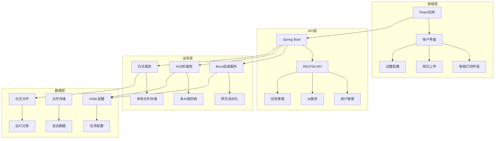

# 智投简历项目技术手册

## 项目简介

### 项目名称
**智投简历** (ZhiTouJianLi) - 智能化求职投递平台

### 项目定位与目标
智投简历是一个基于AI技术的智能求职投递平台，旨在通过人工智能技术解决求职者在简历投递过程中的效率和个性化问题。项目整合了多平台求职功能、AI智能分析和自动化投递能力，为用户提供一站式的求职解决方案。

### 使用场景和主要用户群体
- **主要用户**：求职者、应届毕业生、职场新人、有跳槽需求的在职人员
- **核心场景**：
  - Boss直聘等求职平台的自动化投递
  - 简历与岗位JD的智能匹配分析
  - 个性化打招呼语的AI生成
  - 求职过程的全程数据跟踪和优化

---

## 功能清单

### 用户端功能模块

| 功能模块 | 功能描述 | 价值 |
|---------|---------|------|
| **智能打招呼语** | AI分析简历和JD，生成个性化投递问候语 | 提升HR回复率，增加面试机会 |
| **简历优化跟踪** | 实时分析简历投递状态和效果 | 帮助用户优化投递策略 |
| **职位智能推荐** | 基于简历内容的岗位智能匹配 | 提高岗位匹配精准度 |
| **投递进度管理** | 多平台投递状态统一管理 | 避免重复投递，提升效率 |

### 后端管理功能模块

| 功能模块 | 功能描述 | 价值 |
|---------|---------|------|
| **任务调度管理** | Boss直聘、拉勾等平台自动化投递任务 | 解放用户双手，实现批量投递 |
| **AI服务配置** | 支持OpenAI、DeepSeek、Ollama等多种AI服务 | 灵活切换AI服务，成本可控 |
| **日志监控** | 实时查看任务执行状态和错误日志 | 快速定位问题，保证服务稳定 |
| **用户数据统计** | 投递成功率、回复率等关键指标统计 | 为用户提供数据化决策支持 |

### 核心技术功能

| 功能模块 | 功能描述 | 价值 |
|---------|---------|------|
| **多AI服务集成** | 统一API接口，支持多种AI提供商 | 降低依赖风险，提升服务稳定性 |
| **智能内容生成** | 基于用户输入和岗位要求生成个性化内容 | 确保每个投递都有针对性 |
| **逆向工程支持** | 适配各求职平台的网页结构和接口 | 实现真正的自动化操作 |

---

## 技术架构说明

### 前端架构

**技术选型**：
- **框架**：React 18 + TypeScript
- **UI库**：Tailwind CSS
- **状态管理**：React Hooks + Context
- **构建工具**：Vite
- **包管理**：npm/yarn

**技术特点**：
- 组件化开发，代码复用性高
- TypeScript保证类型安全
- Tailwind CSS快速响应式设计
- 无状态函数组件，性能优化

### 后端架构

**技术选型**：
- **框架**：Spring Boot 2.x
- **项目管理**：Maven
- **JSON处理**：Jackson
- **日志框架**：SLF4J + Logback
- **HTTP客户端**：Java HttpClient

**技术特点**：
- 微服务架构，模块解耦
- RESTful API设计
- 配置外化管理
- 异步任务处理

### 数据存储

**文件存储**：
- **配置存储**：YAML配置文件
- **会话数据**：内存存储 + 文件持久化
- **日志存储**：本地文件系统

**特点**：
- 无数据库依赖，部署简单
- 配置文件易于修改和维护
- 日志文件便于问题排查

### 第三方服务

| 服务类型 | 具体服务 | 用途 |
|---------|---------|------|
| **AI服务** | OpenAI API、DeepSeek API、Ollama本地 | 智能内容生成 |
| **求职平台** | Boss直聘、拉勾网、智联招聘 | 目标平台对接 |
| **HTTP库** | org.json、Java HttpClient | 接口调用和数据处理 |

### 架构图



---

## 项目启动说明

### 环境依赖

**必要软件版本要求**：

| 软件名称 | 版本要求 | 用途 |
|---------|---------|------|
| Java | JDK 17+ | 后端服务运行环境 |
| Node.js | 16.x+ | 前端项目构建和运行 |
| npm | 8.x+ | 前端依赖管理 |
| Maven | 3.6+ | Java项目构建 |

**可选依赖**：
- Git（代码版本管理）
- IntelliJ IDEA / Eclipse（开发IDE）
- Chrome浏览器（测试自动化）

### 安装步骤

#### 1. 项目克隆
```bash
# 克隆项目到本地
git clone https://github.com/your-repo/autoresume.git
cd autoresume
```

#### 2. 后端环境准备
```bash
# 进入后端项目目录
cd get_jobs

# 安装Maven依赖
mvn clean install

# 配置环境变量（可选）
cp src/main/resources/.env_template src/main/resources/.env
```

#### 3. 前端环境准备
```bash
# 前端主站（可选）
cd zhitoujianli-website
npm install

# 博客系统（可选）
cd zhitoujianli-blog
npm install
```

### 本地运行方式

#### 后端服务启动
```bash
# 在 get_jobs 目录下
cd /Users/user/autoresume/get_jobs

# 方式1：Maven运行
mvn spring-boot:run

# 方式2：编译后运行
mvn clean package
java -jar target/get_jobs-*.jar

# 访问地址
http://localhost:8080
```

#### 前端服务启动
```bash
# 主站（可选）
cd zhitoujianli-website
npm start
# 访问地址：http://localhost:3000

# 博客系统（可选）
cd zhitoujianli-blog
npm run dev
# 访问地址：http://localhost:4321/blog/
```

### 生产环境部署步骤

#### Docker部署（推荐）

**1. 后端Docker配置**
```dockerfile
# get_jobs/Dockerfile
FROM openjdk:17-jre-slim
WORKDIR /app
COPY target/get_jobs-*.jar app.jar
EXPOSE 8080
CMD ["java", "-jar", "app.jar"]
```

**2. Docker Compose配置**
```yaml
version: '3.8'
services:
  backend:
    build: ./get_jobs
    ports:
      - "8080:8080"
    environment:
      - SPRING_PROFILES_ACTIVE=prod
      
  frontend:
    build: ./zhitoujianli-website
    ports:
      - "3000:3000"
    depends_on:
      - backend
```

**3. 部署命令**
```bash
# 构建并启动
docker-compose up -d

# 查看服务状态
docker-compose ps

# 查看日志
docker-compose logs -f backend
```

---

## 数据库设计

### 数据库类型
本项目采用**无数据库架构**，使用**文件系统存储**，具体包括：

| 存储类型 | 用途 | 格式 |
|---------|------|------|
| **YAML配置文件** | 任务配置、AI服务配置 | `.yaml` |
| **JSON文件** | 会话数据、黑名单数据 | `.json` |
| **日志文件** | 运行日志、错误记录 | `.log` |
| **Cookie文件** | Web自动化会话保持 | `.json` |

### 核心数据文件结构

#### 1. 配置文件 (`config.yaml`)
```yaml
boss:
  debugger: false                    # 调试模式
  enableAI: true                     # AI功能开关
  cityCode: ["上海"]                  # 目标城市
  keywords: ["市场总监"]              # 搜索关键词
  industry: ["不限"]                  # 行业要求
  experience: ["10年以上"]           # 经验要求
  
ai:
  introduce: "# 自我介绍内容"         # AI自我介绍模板
  prompt: "# AI提示词模板"           # AI对话模板
  greetingStyle: "professional"      # 打招呼语风格
```

#### 2. 数据文件 (`data.json`)
```json
{
  "blackCompanies": ["公司A", "公司B"],
  "blackRecruiters": ["HR1", "HR2"], 
  "blackJobs": ["职位1", "职位2"]
}
```

#### 3. 会话文件 (`cookies.json`)
```json
[
  {
    "name": "session_id",
    "value": "abc123",
    "domain": ".zhipin.com",
    "path": "/"
  }
]
```

### 数据关系说明

**配置层次关系**：
- BossConfig ← AiConfig ← 全局配置
- 任务执行 → 日志记录 → 文件存储
- AI分析 → 生成结果 → 自动化投递

---

## 接口/API说明

### 核心API接口

#### 1. 任务管理接口

| 方法 | 路径 | 功能 | 参数 | 返回值 |
|------|------|------|------|-------|
| POST | `/save-config` | 保存任务配置 | `config: Object` | `{success: boolean, message: string}` |
| POST | `/start-program` | 启动投递任务 | `platform: string` | `{success: boolean, message: string, logFile: string}` |
| POST | `/stop-program` | 停止投递任务 | 无 | `{success: boolean, message: string}` |

**示例请求**：
```bash
# 启动Boss投递任务
curl -X POST http://localhost:8080/start-program \
  -H "Content-Type: application/json" \
  -d '{"platform": "boss"}'
```

**示例响应**：
```json
{
  "success": true,
  "message": "程序启动成功",
  "logFile": "logs/boss_20250128_103012.log"
}
```

#### 2. 状态监控接口

| 方法 | 路径 | 功能 | 参数 | 返回值 |
|------|------|------|------|-------|
| GET | `/status` | 获取服务状态 | 无 | `{isRunning: boolean}` |
| GET | `/logs` | 获取运行日志 | `lines: number` | `log_content: string` |

**示例响应**：
```json
{
  "isRunning": true,
  "currentLogFile": "logs/boss_20250128_103012.log",
  "startTime": "2025-01-28T10:30:12"
}
```

#### 3. AI服务接口（内部）

| 方法 | 类名 | 功能 | 参数 | 返回值 |
|------|------|------|------|-------|
静 态 | `AiService.sendRequest()` | AI对话请求 | `content: String` | `response: String` |
静 态 | `AiConfig.init()` | 获取AI配置 | 无 | `AiConfig对象` |

**示例代码**：
```java
// AI服务调用示例
String prompt = "分析这个岗位: " + jobDescription;
String aiResponse = AiService.sendRequest(prompt);
AiFilter result = parseAiResponse(aiResponse);
```

### 授权与认证方式

**当前认证方式**：
- **本地访问**：无需认证，仅本机访问
- **生产环境**：建议添加Basic Auth或API Key认证

**未来扩展**：
- JWT Token认证
- OAuth 2.0 集成
- 用户权限管理

---

## 项目运维与扩展

### 日志与监控

#### 日志系统
```yaml
# 日志配置 (logback-spring.xml)
logging:
  level:
    root: INFO
    com.superxiang: DEBUG
  pattern:
    console: "%d{yyyy-MM-dd HH:mm:ss} [%thread] %-5level %logger{36} - %msg%n"
    file: "%d{yyyy-MM-dd HH:mm:ss} [%thread] %-5level %logger{36} - %msg%n"
  file:
    name: logs/get_jobs.log
    max-size: 100MB
    max-history: 30
```

**日志分类**：
- **应用日志**：业务逻辑执行记录
- **访问日志**：API请求响应记录
- **错误日志**：异常和错误详细信息
- **任务日志**：自动化任务执行过程

#### 监控指标

| 监控项目 | 监控方式 | 告警阈值 |
|---------|---------|---------|
| **服务状态** | GET /status | 响应时间 > 2s |
| **内存使用** | JVM监控 | 内存使用 > 80% |
| **任务成功率** | 日志分析 | 成功率 < 90% |
| **AI调用延迟** | API计时 | 响应时间 > 30s |

### 常见问题与解决方案

#### 1. 端口占用问题

**问题描述**：
```
Port 8080 is already in use: Address already in use
```

**解决方案**：
```bash
# 查看端口占用
lsof -i :8080

# 终止占用进程
kill -9 <PID>

# 或使用其他端口
java -jar app.jar --server.port=8081
```

#### 2. AI服务连接失败

**问题描述**：
```
AI请求异常！Connection refused
```

**解决方案**：
```bash
# 检查AI服务配置
curl http://localhost:11434/api/tags  # Ollama
curl https://api.deepseek.com/v1/models  # DeepSeek

# 更新配置文件
vi src/main/resources/.env
```

#### 3. Selenium驱动问题

**问题描述**：
```
chrome driver not found
```

**解决方案**：
```bash
# 安装Chrome驱动
brew install chromedriver  # macOS
apt install chromium-driver # Ubuntu

# 或禁用自动化功能
# 在config.yaml中设置 enableAutomation: false
```

### 扩展方向

#### 短期扩展（1-3个月）

1. **多平台支持**：
   - 拉勾网自动化集成
   - 智联招聘API对接
   - 前程无忧平台支持

2. **AI功能增强**：
   - 更多通话语风格选择
   - 行业专业化模板
   - 简历A/B测试功能

3. **用户体验优化**：
   - 移动端适配
   - 批量操作界面
   - 数据可视化dashboard

#### 中期扩展（3-6个月）

1. **智能分析升级**：
   - 行业内薪资分析
   - 竞争对手分析
   - 求职趋势预测

2. **社交化功能**：
   - 求职经验分享
   - 行业交流社区
   - 导师匹配系统

3. **企业版功能**：
   - HR招聘工具
   - 候选人管理
   - 面试安排系统

#### 长期愿景（6-12个月）

1. **平台化转型**：
   - 开放API接口
   - 第三方集成
   - 生态合作伙伴

2. **大数据分析**：
   - 求职市场洞察
   - 个性化推荐引擎
   - 职业发展路径规划

---

## 附录

### 相关资料与链接

#### 技术文档
- [Spring Boot官方文档](https://spring.io/projects/spring-boot)
- [React官网](https://reactjs.org/)
- [Tailwind CSS文档](https://tailwindcss.com/)
- [Astro框架文档](https://astro.build/)

#### AI服务文档
- [OpenAI API文档](https://platform.openai.com/docs)
- [DeepSeek API文档](https://platform.deepseek.com/api-docs/)
- [Ollama本地部署](https://ollama.ai/docs)

#### 求职平台API
- [Boss直聘开发者文档](https://open.bosszhipin.com/)
- [拉勾网API文档](https://lagou.com/api)

### 常用命令汇总

#### 开发调试命令
```bash
# 后端开发
mvn spring-boot:run              # 启动开发服务器
mvn clean package               # 编译打包
java -jar target/app.jar        # 运行编译后的jar

# 前端开发  
npm start                       # React应用启动
npm run build                   # 生产环境构建
npm run dev                     # Astro博客启动

# 项目调试
curl http://localhost:8080/status    # 检查服务状态
curl http://localhost:8080/logs      # 查看运行日志
```

#### 部署运维命令
```bash
# Docker部署
docker-compose up -d            # 启动所有服务
docker-compose logs -f backend  # 查看后端日志
docker-compose restart backend  # 重启后端服务

# 日志管理
tail -f logs/get_jobs.log       # 实时查看日志
grep "ERROR" logs/*.log         # 查找错误日志
find logs -name "*.log" -mtime +30 | xargs rm  # 清理30天前日志
```

#### AI服务测试命令
```bash
# 测试OpenAI连接
curl -H "Authorization: Bearer $OPENAI_API_KEY" \
     -H "Content-Type: application/json" \
     https://api.deepseek.com/v1/models

# 测试Ollama连接  
curl http://localhost:11434/api/tags
curl http://localhost:11434/api/generate -d '{"model": "qwen2", "prompt": "测试"}'
```

### 术语解释（面向非技术人员）

| 术语 | 通俗解释 | 在项目中的作用 |
|------|---------|---------------|
| **Frontend（前端）** | 用户看到的网页界面 | 用户通过浏览器访问的求职平台界面 |
| **Backend（后端）** | 服务器端的业务逻辑 | 处理AI分析、自动化投递等核心功能 |
| **API** | 不同系统间通信的接口 | 前端调用后端功能的桥梁 |
| **AI（人工智能）** | 模拟人类智能的计算机技术 | 自动分析简历和岗位要求，生成个性化内容 |
| **自动化** | 无需人工干预的计算机任务 | 自动在求职平台投递简历，无需手工操作 |
| **配置管理** | 管理程序运行参数的方法 | 用户可以通过修改配置文件调整求职策略 |
| **日志** | 程序运行过程的详细记录 | 帮助开发者了解程序运行状态，排查问题 |
| **部署** | 将程序放到服务器上运行的过程 | 项目从开发环境发布到用户可访问的环境 |

### 项目维护建议

#### 日常维护
1. **每周检查**：服务状态、错误日志、AI服务可用性
2. **每月优化**：更新依赖版本、优化配置文件、清理无用文件
3. **季度升级**：功能更新、安全补丁、性能优化

#### 数据备份
```bash
# 配置文件备份
cp config.yaml config.yaml.backup.$(date +%Y%m%d)

# 日志文件备份
tar -czf logs_backup_$(date +%Y%m%d).tar.gz logs/

# Cookie文件备份
cp cookies.json cookies.json.backup.$(date +%Y%m%d)
```

#### 性能优化建议
1. **AI调用优化**：添加请求缓存、批量处理、异步调用
2. **自动化优化**：智能重试机制、并发控制、任务调度优化
3. **存储优化**：日志轮转、配置文件压缩、数据清理策略

---

*本文档最后更新时间：2025年9月29日*  
*版本号：1.0*  
*如有疑问，请联系项目维护团队*