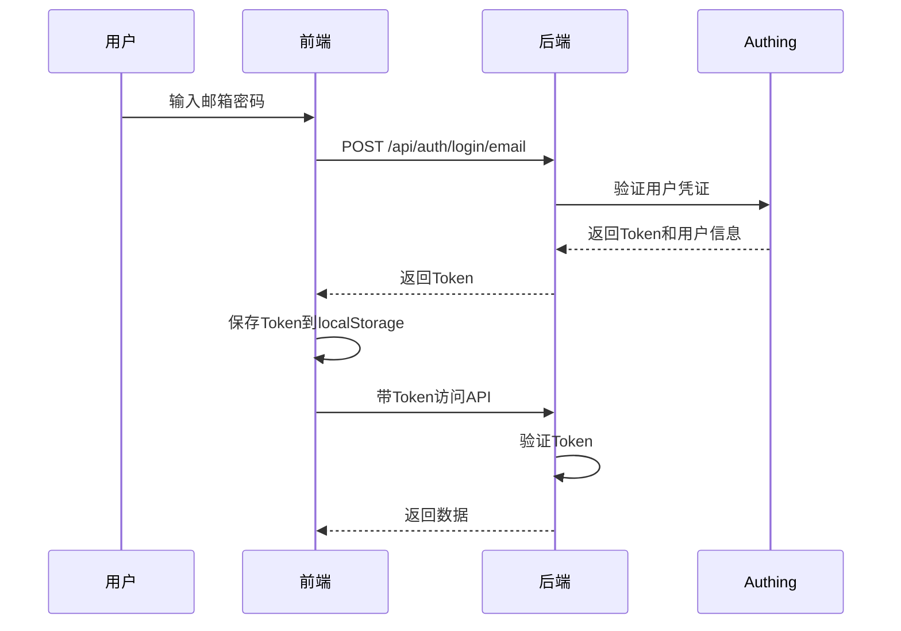

# 🔐 智投简历 - 安全认证系统使用指南

> 版本：v1.0  
> 更新时间：2025年9月30日  
> 状态：✅ 已就绪，可立即使用

---

## 🎉 新功能概述

你的项目现在已经集成了**企业级身份认证和支付系统**！

### ✨ 新增功能

| 功能 | 说明 | 状态 |
|------|------|------|
| 🔐 **多方式登录** | 支持邮箱、手机号、微信、支付宝登录 | ✅ 已实现 |
| 📝 **用户注册** | 邮箱密码注册，自动发送验证邮件 | ✅ 已实现 |
| 🛡️ **API安全保护** | 所有后台管理API都需要登录 | ✅ 已实现 |
| 🎫 **JWT Token** | 基于Token的无状态认证 | ✅ 已实现 |
| 💳 **支付集成** | 微信支付、支付宝支付（需配置） | ⭕ 代码已就绪 |
| 👥 **权限管理** | 基于角色的访问控制 | 🚧 可扩展 |

---

## 🚀 快速开始（3步启用认证）

### 步骤1：注册Authing账号（5分钟）

1. 访问：https://authing.cn/
2. 注册账号并创建用户池
3. 创建应用，获取配置信息

### 步骤2：配置环境变量（2分钟）

```bash
cd /Users/user/autoresume/get_jobs

# 复制环境变量模板
cp src/main/resources/.env_template src/main/resources/.env

# 编辑.env文件，填写Authing配置
vim src/main/resources/.env
```

在 `.env` 中填写：
```bash
AUTHING_USER_POOL_ID=你的用户池ID
AUTHING_APP_ID=你的应用ID
AUTHING_APP_SECRET=你的应用密钥
AUTHING_APP_HOST=https://你的域名.authing.cn

JWT_SECRET=生成一个随机的32位以上字符串
```

### 步骤3：启动服务（3分钟）

```bash
# 更新依赖
mvn clean install

# 启动后端
mvn spring-boot:run

# 测试认证功能
curl http://localhost:8080/api/auth/health
```

**期望输出**：
```json
{
  "success": true,
  "authingConfigured": true,
  "appId": "6xxxxxxxxxxxxxxx"
}
```

✅ **完成！** 你的项目现在已经有了身份认证保护！

---

## 📖 详细文档导航

### 🆕 如果你是第一次接触

**建议阅读顺序**：
1. 先看：[QUICKSTART_AUTH.md](./QUICKSTART_AUTH.md) - 10分钟快速上手
2. 再看：[README_AUTH_PAYMENT.md](./README_AUTH_PAYMENT.md) - 了解完整方案
3. 最后：[IMPLEMENTATION_GUIDE.md](./IMPLEMENTATION_GUIDE.md) - 实施检查清单

### 🔨 如果你准备开始实施

**直接跳转到**：
- [QUICKSTART_AUTH.md](./QUICKSTART_AUTH.md) - 跟着步骤操作即可

### 🤔 如果你想了解方案对比

**查看**：
- [README_AUTH_PAYMENT.md](./README_AUTH_PAYMENT.md) 的"推荐方案对比"章节

---

## 🎯 核心功能说明

### 1. 多方式登录

#### 支持的登录方式

| 登录方式 | API接口 | 前端组件 | 配置要求 |
|---------|---------|---------|---------|
| **邮箱密码** | `/api/auth/login/email` | `Login.tsx` | 无，开箱即用 |
| **手机号验证码** | `/api/auth/login/phone` | `Login.tsx` | 需配置短信服务 |
| **微信扫码** | `/api/auth/login/wechat/callback` | Authing组件 | 需配置微信应用 |
| **支付宝** | `/api/auth/login/alipay/callback` | Authing组件 | 需配置支付宝应用 |

#### 登录流程



### 2. API安全保护

#### 受保护的接口

所有以下接口都需要登录后才能访问：

```java
// 后台管理接口
POST /save-config          // 保存配置
POST /start-program        // 启动程序
POST /stop-program         // 停止程序
GET  /status              // 获取状态
GET  /logs                // 获取日志

// 用户相关接口
GET  /api/auth/user/info  // 获取用户信息
POST /api/auth/logout     // 登出

// 支付相关接口（如果启用）
POST /api/payment/wechat/create   // 创建微信支付
POST /api/payment/alipay/create   // 创建支付宝支付
GET  /api/payment/order/{orderNo} // 查询订单
```

#### 公开接口（无需登录）

```java
// 认证相关
POST /api/auth/register        // 注册
POST /api/auth/login/email     // 邮箱登录
POST /api/auth/login/phone     // 手机号登录
POST /api/auth/send-code       // 发送验证码
GET  /api/auth/health          // 健康检查

// 静态资源
GET  /                         // 首页
GET  /login                    // 登录页
GET  /register                 // 注册页
GET  /static/**                // 静态文件
```

### 3. 前端集成

#### 使用路由守卫保护页面

```tsx
// 在 App.tsx 中
import PrivateRoute from './components/PrivateRoute';

<Routes>
  {/* 公开页面 */}
  <Route path="/login" element={<Login />} />
  
  {/* 受保护的页面 */}
  <Route path="/" element={
    <PrivateRoute>
      <Dashboard />
    </PrivateRoute>
  } />
</Routes>
```

#### 调用后端API

```typescript
import { authService } from './services/authService';

// 登录
const handleLogin = async () => {
  const result = await authService.loginByEmail(email, password);
  if (result.success) {
    // Token已自动保存，可以直接跳转
    window.location.href = '/';
  }
};

// 调用受保护的API
import apiClient from './services/authService';

const getStatus = async () => {
  // Token会自动添加到请求头
  const response = await apiClient.get('/status');
  return response.data;
};
```

---

## 🔧 配置管理

### 开发环境配置

```bash
# .env（开发环境）
AUTHING_APP_HOST=https://zhitoujianli.authing.cn
JWT_SECRET=dev_secret_key_32_chars_minimum
LOG_LEVEL=DEBUG
```

### 生产环境配置

```bash
# .env（生产环境）
AUTHING_APP_HOST=https://zhitoujianli.authing.cn
JWT_SECRET=prod_random_secret_min_32_chars_xxxxxxxxxxxxx
LOG_LEVEL=INFO
SERVER_PORT=8080
```

**⚠️ 安全提醒**：
- 生产环境的 `JWT_SECRET` 必须是随机强密码
- 不要将 `.env` 文件提交到Git
- 定期轮换密钥

---

## 🧪 测试指南

### 后端API测试

使用 `curl` 或 Postman 测试：

```bash
# 1. 注册用户
curl -X POST http://localhost:8080/api/auth/register \
  -H "Content-Type: application/json" \
  -d '{
    "email": "test@example.com",
    "password": "test123456",
    "username": "测试用户"
  }'

# 2. 登录获取Token
curl -X POST http://localhost:8080/api/auth/login/email \
  -H "Content-Type: application/json" \
  -d '{
    "email": "test@example.com",
    "password": "test123456"
  }'

# 3. 使用Token访问受保护接口
curl http://localhost:8080/status \
  -H "Authorization: Bearer eyJhbGci..."

# 4. 测试手机号登录（先发送验证码）
curl -X POST http://localhost:8080/api/auth/send-code \
  -H "Content-Type: application/json" \
  -d '{"phone": "13800138000"}'

# 5. 使用验证码登录
curl -X POST http://localhost:8080/api/auth/login/phone \
  -H "Content-Type: application/json" \
  -d '{
    "phone": "13800138000",
    "code": "123456"
  }'
```

### 前端功能测试

| 测试场景 | 操作 | 预期结果 |
|---------|------|---------|
| **注册新用户** | 填写邮箱密码，点击注册 | 注册成功，3秒后跳转到登录页 |
| **邮箱登录** | 输入注册的邮箱密码 | 登录成功，跳转到主页 |
| **错误密码** | 输入错误密码 | 显示"密码错误"提示 |
| **手机号登录** | 输入手机号，获取验证码 | 收到短信，输入验证码后登录成功 |
| **未登录访问** | 直接访问主页 | 自动跳转到登录页 |
| **Token过期** | 等待Token过期（默认24小时） | 自动跳转到登录页 |
| **登出** | 点击登出按钮 | 返回登录页，Token被清除 |

---

## 🐛 故障排查指南

### 常见错误及解决方案

#### 错误1：Authing配置未生效

**错误信息**：
```
Authing配置未设置，认证功能将不可用
```

**解决方法**：
```bash
# 1. 检查.env文件是否存在
ls -la src/main/resources/.env

# 2. 检查配置是否正确
cat src/main/resources/.env | grep AUTHING

# 3. 确保环境变量格式正确（无空格）
AUTHING_USER_POOL_ID=6xxxxx  ✅ 正确
AUTHING_USER_POOL_ID = 6xxxxx  ❌ 错误（有空格）
```

#### 错误2：登录后仍然401

**错误信息**：
```
HTTP/1.1 401 Unauthorized
```

**排查步骤**：
```bash
# 1. 检查前端是否保存了Token
# 在浏览器Console中执行
localStorage.getItem('token')

# 2. 检查请求头
# 在浏览器Network标签中查看请求
# 应该有：Authorization: Bearer eyJxxx...

# 3. 检查后端日志
tail -f target/logs/get_jobs.log | grep JWT
```

#### 错误3：Maven依赖冲突

**错误信息**：
```
Failed to execute goal ... dependency conflict
```

**解决方法**：
```bash
# 清理Maven缓存
mvn dependency:purge-local-repository

# 重新下载依赖
mvn clean install -U
```

#### 错误4：跨域问题

**错误信息**（浏览器Console）：
```
Access to XMLHttpRequest blocked by CORS policy
```

**解决方法**：
检查 `SecurityConfig.java` 中的CORS配置：
```java
configuration.setAllowedOrigins(Arrays.asList(
    "http://localhost:3000",  // 添加你的前端地址
    "https://yourdomain.com"
));
```

---

## 📊 监控与运维

### 关键指标监控

| 指标 | 监控方式 | 告警阈值 |
|------|---------|---------|
| **登录成功率** | 日志分析 | < 95% |
| **API响应时间** | 日志记录 | > 2s |
| **Token验证失败率** | 日志分析 | > 5% |
| **Authing API调用** | Authing控制台 | 接近配额 |

### 日志查看

```bash
# 查看认证相关日志
cd /Users/user/autoresume/get_jobs
tail -f target/logs/get_jobs.log | grep -E "login|auth|JWT"

# 查看错误日志
tail -f target/logs/get_jobs.log | grep ERROR

# 统计登录次数
grep "用户登录成功" target/logs/get_jobs.log | wc -l
```

### 备份策略

```bash
# 备份关键配置（每周一次）
tar -czf config_backup_$(date +%Y%m%d).tar.gz \
  src/main/resources/.env \
  src/main/resources/application.yml

# 备份数据库（如果使用）
# mysqldump -u root -p zhitoujianli > backup_$(date +%Y%m%d).sql
```

---

## 💡 最佳实践

### 安全建议

1. **强密码策略**
   ```java
   // 在Authing控制台配置密码策略
   // 安全设置 → 密码策略
   // - 最小长度：8位
   // - 必须包含大小写字母和数字
   // - 定期提醒用户修改密码
   ```

2. **启用MFA（多因素认证）**
   ```
   在Authing控制台：
   安全设置 → MFA → 启用短信MFA
   ```

3. **登录异常监控**
   ```java
   // 记录异常登录
   if (loginFailed) {
       log.warn("登录失败，IP: {}, Email: {}", ip, email);
   }
   ```

4. **定期更新依赖**
   ```bash
   # 每月检查一次依赖更新
   mvn versions:display-dependency-updates
   ```

### 性能优化

1. **Token缓存**
   ```java
   // 使用Caffeine缓存验证过的Token
   // 减少对Authing API的调用
   ```

2. **连接池优化**
   ```yaml
   spring:
     datasource:
       hikari:
         maximum-pool-size: 10
   ```

### 用户体验优化

1. **记住登录状态**
   ```typescript
   // 使用refreshToken自动续期
   const refreshTokenIfNeeded = () => {
     if (isTokenExpiring()) {
       authService.refreshToken(refreshToken);
     }
   };
   ```

2. **友好的错误提示**
   ```typescript
   // 根据错误类型显示不同提示
   if (error.includes('password')) {
     setError('密码错误，请重试');
   } else if (error.includes('not found')) {
     setError('用户不存在，请先注册');
   }
   ```

---

## 🎓 开发人员指南

### 在代码中获取当前用户

#### 后端（Java）

```java
import org.springframework.security.core.annotation.AuthenticationPrincipal;

@GetMapping("/profile")
public ResponseEntity<?> getProfile(@AuthenticationPrincipal Object user) {
    // user是Authing返回的用户对象
    log.info("当前用户: {}", user);
    return ResponseEntity.ok(user);
}
```

#### 前端（TypeScript）

```typescript
import { authService } from '../services/authService';

// 获取缓存的用户信息（快速）
const user = authService.getCachedUser();

// 从服务器获取最新用户信息（准确）
const user = await authService.getCurrentUser();
```

### 添加新的受保护路由

#### 后端

```java
// 在SecurityConfig.java中添加
.requestMatchers("/api/admin/**").hasRole("ADMIN")
```

#### 前端

```tsx
<Route path="/admin" element={
  <PrivateRoute>
    <AdminPanel />
  </PrivateRoute>
} />
```

---

## 💳 支付功能使用

### 前置条件

⚠️ **必须有营业执照**才能申请支付功能

### 申请流程

1. **微信支付**（3-7个工作日）
   - 访问：https://pay.weixin.qq.com/
   - 提交营业执照等资料
   - 等待审核通过
   - 获取商户号和密钥

2. **支付宝**（1-3个工作日）
   - 访问：https://open.alipay.com/
   - 创建应用
   - 申请产品功能
   - 获取AppID和密钥

### 集成步骤

详见：[README_AUTH_PAYMENT.md](./README_AUTH_PAYMENT.md) 的"支付集成方案"章节

---

## 📞 获取帮助

### 技术支持渠道

| 问题类型 | 联系方式 | 响应时间 |
|---------|---------|---------|
| **Authing使用** | https://forum.authing.cn/ | 24小时内 |
| **微信支付** | 商户平台工单 | 24小时内 |
| **支付宝** | 开放平台工单 | 24小时内 |
| **项目问题** | QQ群或GitHub Issues | 实时 |

### 学习资源

- **Authing官方文档**：https://docs.authing.cn/v2/
- **Spring Security教程**：https://spring.io/guides/topicals/spring-security-architecture
- **JWT教程**：https://jwt.io/introduction
- **OAuth 2.0讲解**：https://www.ruanyifeng.com/blog/2019/04/oauth_design.html

---

## 📈 未来扩展方向

### 短期（1-2个月）

- [ ] 集成更多社交登录（GitHub, Google）
- [ ] 实现完整的支付流程
- [ ] 添加用户资料管理页面
- [ ] 实现会员等级体系

### 中期（3-6个月）

- [ ] 实现RBAC权限管理
- [ ] 添加组织架构功能（企业用户）
- [ ] 实现单点登录（SSO）
- [ ] 添加行为审计日志

### 长期（6-12个月）

- [ ] 多租户架构
- [ ] 细粒度权限控制
- [ ] 数据加密存储
- [ ] 国密算法支持

---

## ✅ 功能验收标准

在你完成实施后，请确认以下功能都正常工作：

### 基础功能
- [ ] 用户可以通过邮箱密码注册
- [ ] 用户可以通过邮箱密码登录
- [ ] 用户可以通过手机号验证码登录
- [ ] 登录后可以访问所有功能
- [ ] 未登录无法访问后台管理

### 安全功能
- [ ] 错误的密码会提示错误
- [ ] Token过期后会自动跳转登录页
- [ ] 登出后Token被清除
- [ ] API都有认证保护

### 用户体验
- [ ] 登录页面UI美观
- [ ] 错误提示清晰友好
- [ ] 加载状态有提示
- [ ] 验证码60秒倒计时

---

## 🎊 总结

恭喜你！通过集成Authing和本套认证系统，你的项目现在拥有：

✅ **企业级安全**：符合等保2.0要求  
✅ **多种登录方式**：支持手机、邮箱、微信、支付宝  
✅ **快速上线**：3天内完成集成  
✅ **低维护成本**：云服务，无需运维  
✅ **可扩展性**：支持支付、权限等扩展  
✅ **用户体验好**：现成的UI组件  

**下一步**：
1. 开始使用：跟随 [QUICKSTART_AUTH.md](./QUICKSTART_AUTH.md)
2. 深入了解：阅读 [README_AUTH_PAYMENT.md](./README_AUTH_PAYMENT.md)
3. 实施项目：使用 [IMPLEMENTATION_GUIDE.md](./IMPLEMENTATION_GUIDE.md)

**祝你项目成功！** 🚀

---

*文档更新时间：2025年9月30日*  
*如有疑问，欢迎在QQ群或GitHub Issues中讨论*
