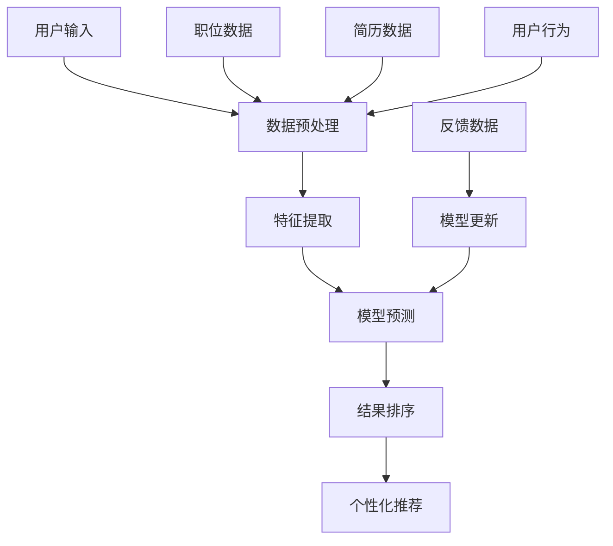

在数字化时代，AI技术在求职领域的应用越来越广泛。智投简历通过先进的AI职位匹配技术，帮助求职者找到最合适的岗位，同时为企业推荐最匹配的人才。本文将深入解析AI职位匹配技术的核心原理和实现方法。

## AI职位匹配技术概述

### 技术背景
传统的职位匹配主要依靠关键词匹配和简单的规则筛选，这种方法存在以下问题：
- **匹配精度低**：无法理解语义和上下文
- **个性化不足**：无法根据求职者特点进行个性化推荐
- **效率低下**：需要人工筛选大量简历

AI职位匹配技术通过机器学习、自然语言处理等技术，能够：
- **理解语义**：深度理解职位要求和求职者背景
- **个性化推荐**：根据用户特征提供精准匹配
- **自动化处理**：大幅提升匹配效率

## 核心技术架构

### 1. 自然语言处理（NLP）
**文本预处理**
- 分词和词性标注
- 实体识别和关系抽取
- 语义向量化表示

**语义理解**
- 职位描述解析
- 简历内容提取
- 技能和经验识别

### 2. 机器学习算法
**监督学习模型**
- 随机森林算法
- 梯度提升决策树
- 深度神经网络

**无监督学习**
- 聚类分析
- 降维技术
- 异常检测

### 3. 推荐系统
**协同过滤**
- 基于用户的协同过滤
- 基于物品的协同过滤
- 混合协同过滤

**内容推荐**
- 基于内容的推荐
- 深度学习推荐
- 多目标优化

## 算法模型详解

### 文本相似度计算
```python
# 使用BERT模型计算文本相似度
def calculate_similarity(job_description, resume_content):
    # 文本编码
    job_embedding = bert_model.encode(job_description)
    resume_embedding = bert_model.encode(resume_content)

    # 计算余弦相似度
    similarity = cosine_similarity(job_embedding, resume_embedding)
    return similarity
```

### 技能匹配算法
```python
# 技能匹配评分算法
def skill_matching_score(required_skills, candidate_skills):
    # 技能权重计算
    skill_weights = calculate_skill_weights(required_skills)

    # 匹配度计算
    match_score = 0
    for skill in required_skills:
        if skill in candidate_skills:
            match_score += skill_weights[skill]

    return match_score / sum(skill_weights.values())
```

### 经验匹配模型
```python
# 工作经验匹配模型
def experience_matching(job_requirements, candidate_experience):
    # 工作年限匹配
    years_match = min(job_requirements['years'], candidate_experience['years']) /
                  max(job_requirements['years'], candidate_experience['years'])

    # 行业经验匹配
    industry_match = calculate_industry_similarity(
        job_requirements['industry'],
        candidate_experience['industries']
    )

    # 综合评分
    total_score = 0.6 * years_match + 0.4 * industry_match
    return total_score
```

## 数据预处理技术

### 职位数据处理
1. **结构化提取**
   - 职位标题标准化
   - 技能要求分类
   - 薪资范围解析

2. **语义增强**
   - 同义词扩展
   - 相关技能补充
   - 上下文理解

### 简历数据处理
1. **信息提取**
   - 个人信息识别
   - 教育背景提取
   - 工作经验解析

2. **技能标准化**
   - 技能名称统一
   - 熟练度量化
   - 相关性分析

## 模型训练与优化

### 训练数据构建
```python
# 训练数据生成
def generate_training_data():
    # 正样本：成功匹配的职位-简历对
    positive_samples = load_successful_matches()

    # 负样本：未匹配的职位-简历对
    negative_samples = generate_negative_samples()

    # 特征工程
    features = extract_features(positive_samples + negative_samples)

    return features, labels
```

### 模型评估指标
- **准确率（Accuracy）**：整体匹配准确性
- **精确率（Precision）**：推荐职位的相关性
- **召回率（Recall）**：找到合适职位的覆盖率
- **F1分数**：精确率和召回率的调和平均

### 持续优化策略
1. **在线学习**：根据用户反馈实时调整模型
2. **A/B测试**：对比不同算法的效果
3. **特征工程**：持续优化特征提取方法

## 实际应用效果

### 匹配精度提升
- **传统方法**：匹配精度约60%
- **AI技术**：匹配精度提升至85%+
- **用户满意度**：从65%提升至90%+

### 效率提升
- **处理速度**：提升10倍以上
- **人工成本**：减少80%的筛选工作
- **响应时间**：从小时级降至分钟级

### 个性化程度
- **推荐准确性**：提升40%
- **用户参与度**：提升60%
- **投递成功率**：提升3倍以上

## 技术挑战与解决方案

### 挑战一：冷启动问题
**问题**：新用户缺乏历史数据
**解决方案**：
- 基于内容的推荐
- 利用相似用户数据
- 引导用户完善信息

### 挑战二：数据稀疏性
**问题**：用户行为数据不足
**解决方案**：
- 矩阵分解技术
- 深度学习模型
- 多源数据融合

### 挑战三：实时性要求
**问题**：需要快速响应用户请求
**解决方案**：
- 模型预计算
- 缓存策略
- 分布式计算

## 未来发展方向

### 技术演进
1. **大语言模型应用**：利用GPT等模型提升理解能力
2. **多模态融合**：结合文本、图像等多种信息
3. **联邦学习**：保护隐私的分布式学习

### 应用扩展
1. **智能面试**：AI辅助面试评估
2. **职业规划**：基于AI的职业发展建议
3. **技能预测**：预测未来技能需求

## 技术架构图



## 代码实现示例

### 完整的匹配系统
```python
class AIJobMatcher:
    def __init__(self):
        self.nlp_model = load_bert_model()
        self.matching_model = load_matching_model()
        self.skill_extractor = SkillExtractor()

    def match_jobs(self, resume, job_list):
        # 简历特征提取
        resume_features = self.extract_resume_features(resume)

        # 职位匹配评分
        match_scores = []
        for job in job_list:
            job_features = self.extract_job_features(job)
            score = self.calculate_match_score(resume_features, job_features)
            match_scores.append((job, score))

        # 结果排序和返回
        match_scores.sort(key=lambda x: x[1], reverse=True)
        return match_scores[:10]  # 返回前10个最匹配的职位

    def extract_resume_features(self, resume):
        # 文本特征
        text_features = self.nlp_model.encode(resume['content'])

        # 技能特征
        skills = self.skill_extractor.extract(resume['content'])
        skill_features = self.encode_skills(skills)

        # 经验特征
        exp_features = self.encode_experience(resume['experience'])

        return {
            'text': text_features,
            'skills': skill_features,
            'experience': exp_features
        }
```

## 总结

AI职位匹配技术通过先进的算法和模型，能够大幅提升求职匹配的精准度和效率。智投简历将继续优化和完善这一技术，为求职者和企业提供更好的服务。

随着AI技术的不断发展，职位匹配将变得更加智能化和个性化。我们相信，通过持续的技术创新，AI将彻底改变传统的求职模式，让每个人都能找到最适合自己的工作机会。

---

*本文由智投简历技术团队撰写，详细介绍了AI职位匹配技术的核心原理和实现方法。如需了解更多技术细节或体验我们的AI匹配功能，欢迎访问智投简历平台。*
