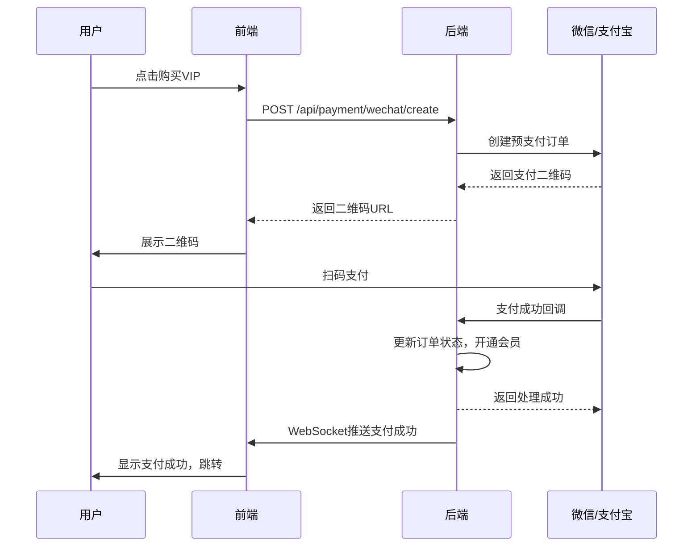

# 智投简历 - 身份认证与支付系统集成方案

> 📅 文档创建时间：2025年9月30日  
> 🎯 目标：为项目提供安全、简单、成熟的注册登录和支付解决方案

---

## 📋 目录

- [方案概述](#方案概述)
- [推荐方案对比](#推荐方案对比)
- [方案A：Authing（推荐）](#方案a-authing推荐)
- [方案B：开源自建方案](#方案b-开源自建方案)
- [支付集成方案](#支付集成方案)
- [实施路线图](#实施路线图)

---

## 🎯 方案概述

### 当前问题
- ❌ 后台管理无任何登录保护
- ❌ 所有API接口可被公开访问
- ❌ 用户数据无权限隔离
- ❌ 无支付功能，无法商业化

### 解决目标
- ✅ 支持支付宝、微信、手机号、邮箱登录
- ✅ 使用成熟方案，不从头开发
- ✅ 保证数据安全和合规性
- ✅ 集成支付功能（微信、支付宝）
- ✅ 快速上线，维护成本低

---

## 🏆 推荐方案对比

| 方案 | 优势 | 劣势 | 开发周期 | 成本 | 推荐度 |
|------|------|------|----------|------|--------|
| **Authing** | 开箱即用，国内服务快，中文支持好 | 有免费额度限制 | 1-3天 | 免费版够用 | ⭐⭐⭐⭐⭐ |
| **Keycloak** | 完全开源免费，功能强大 | 需要自己部署维护 | 3-5天 | 服务器成本 | ⭐⭐⭐⭐ |
| **Spring Security + 自开发** | 完全自主控制 | 开发周期长，容易出现安全漏洞 | 7-14天 | 人力成本高 | ⭐⭐ |
| **Supabase Auth** | 开源，功能完整 | 国内访问较慢 | 2-4天 | 有免费额度 | ⭐⭐⭐ |

---

## 🥇 方案A：Authing（推荐）

### 为什么选择Authing？

**Authing** 是国内最专业的身份认证云服务（中国版Auth0），专为中国开发者设计：

✅ **开箱即用**：无需开发登录页面，提供现成的UI组件  
✅ **全登录方式**：支持微信、支付宝、手机号、邮箱、GitHub等20+登录方式  
✅ **安全合规**：符合等保2.0要求，通过ISO27001认证  
✅ **免费额度**：每月8000 MAU（月活用户）免费  
✅ **中文支持**：完整的中文文档和技术支持  
✅ **快速集成**：Spring Boot官方SDK，10分钟集成完成

### 核心功能

| 功能类别 | 具体功能 |
|---------|---------|
| **社交登录** | 微信扫码/网页授权、支付宝登录、QQ登录、微博登录 |
| **传统登录** | 手机号验证码、邮箱密码、邮箱验证码 |
| **企业登录** | 企业微信、钉钉、飞书 |
| **国际登录** | Google、GitHub、Apple、Facebook |
| **安全功能** | MFA多因素认证、设备指纹、登录风控、行为分析 |
| **权限管理** | RBAC角色权限、ABAC属性权限、组织架构管理 |

### 集成步骤

#### 第一步：注册Authing账号

1. 访问 [https://authing.cn/](https://authing.cn/) 注册账号
2. 创建用户池（User Pool）
3. 获取配置信息：
   - `User Pool ID`（用户池ID）
   - `App ID`（应用ID）
   - `App Secret`（应用密钥）

#### 第二步：Maven依赖配置

在 `get_jobs/pom.xml` 中添加依赖：

```xml
<!-- Authing Java SDK -->
<dependency>
    <groupId>cn.authing</groupId>
    <artifactId>authing-java-sdk</artifactId>
    <version>3.0.0</version>
</dependency>

<!-- JWT Token处理 -->
<dependency>
    <groupId>io.jsonwebtoken</groupId>
    <artifactId>jjwt-api</artifactId>
    <version>0.12.5</version>
</dependency>
<dependency>
    <groupId>io.jsonwebtoken</groupId>
    <artifactId>jjwt-impl</artifactId>
    <version>0.12.5</version>
    <scope>runtime</scope>
</dependency>
<dependency>
    <groupId>io.jsonwebtoken</groupId>
    <artifactId>jjwt-jackson</artifactId>
    <version>0.12.5</version>
    <scope>runtime</scope>
</dependency>

<!-- Spring Security -->
<dependency>
    <groupId>org.springframework.boot</groupId>
    <artifactId>spring-boot-starter-security</artifactId>
</dependency>
```

#### 第三步：环境变量配置

在 `src/main/resources/.env` 中添加：

```bash
# Authing配置
AUTHING_USER_POOL_ID=your_user_pool_id
AUTHING_APP_ID=your_app_id
AUTHING_APP_SECRET=your_app_secret
AUTHING_APP_HOST=https://your-domain.authing.cn

# JWT配置
JWT_SECRET=your_super_secret_jwt_key_change_in_production
JWT_EXPIRATION=86400000

# 原有配置保持不变
HOOK_URL=...
BASE_URL=...
```

#### 第四步：代码集成架构

```
get_jobs/
└── src/main/java/
    ├── config/
    │   ├── AuthingConfig.java          # Authing配置类
    │   └── SecurityConfig.java         # Spring Security配置
    ├── security/
    │   ├── JwtTokenProvider.java       # JWT令牌生成与验证
    │   ├── JwtAuthenticationFilter.java # JWT过滤器
    │   └── AuthenticationService.java   # 认证服务
    ├── controller/
    │   ├── AuthController.java         # 认证控制器（登录/注册/登出）
    │   └── WebController.java          # 现有控制器（添加权限保护）
    ├── model/
    │   └── User.java                   # 用户模型
    └── interceptor/
        └── AuthInterceptor.java        # 认证拦截器
```

#### 第五步：代码实现示例

**1. Authing配置类**

```java
package config;

import cn.authing.sdk.java.client.ManagementClient;
import org.springframework.beans.factory.annotation.Value;
import org.springframework.context.annotation.Bean;
import org.springframework.context.annotation.Configuration;

@Configuration
public class AuthingConfig {
    
    @Value("${authing.userPoolId}")
    private String userPoolId;
    
    @Value("${authing.appSecret}")
    private String appSecret;
    
    @Bean
    public ManagementClient managementClient() {
        ManagementClient client = new ManagementClient(userPoolId, appSecret);
        return client;
    }
}
```

**2. 认证控制器**

```java
package controller;

import cn.authing.sdk.java.client.AuthenticationClient;
import cn.authing.sdk.java.dto.*;
import lombok.extern.slf4j.Slf4j;
import org.springframework.beans.factory.annotation.Value;
import org.springframework.http.ResponseEntity;
import org.springframework.web.bind.annotation.*;

import java.util.HashMap;
import java.util.Map;

@RestController
@RequestMapping("/api/auth")
@Slf4j
public class AuthController {

    @Value("${authing.appId}")
    private String appId;

    /**
     * 手机号验证码登录
     */
    @PostMapping("/login/phone")
    public ResponseEntity<?> loginByPhone(@RequestBody Map<String, String> request) {
        try {
            String phone = request.get("phone");
            String code = request.get("code");
            
            AuthenticationClient client = new AuthenticationClient();
            client.setAppId(appId);
            
            SignInByPhonePassCodeDto dto = new SignInByPhonePassCodeDto();
            dto.setPhoneNumber(phone);
            dto.setPassCode(code);
            
            LoginTokenRespDto result = client.signInByPhonePassCode(dto);
            
            Map<String, Object> response = new HashMap<>();
            response.put("success", true);
            response.put("token", result.getAccessToken());
            response.put("user", result.getData());
            
            return ResponseEntity.ok(response);
        } catch (Exception e) {
            log.error("手机号登录失败", e);
            return ResponseEntity.badRequest()
                .body(Map.of("success", false, "message", e.getMessage()));
        }
    }

    /**
     * 发送手机验证码
     */
    @PostMapping("/send-code")
    public ResponseEntity<?> sendPhoneCode(@RequestBody Map<String, String> request) {
        try {
            String phone = request.get("phone");
            
            AuthenticationClient client = new AuthenticationClient();
            client.setAppId(appId);
            
            SendSMSDto dto = new SendSMSDto();
            dto.setPhoneNumber(phone);
            
            SendSMSRespDto result = client.sendSms(dto);
            
            return ResponseEntity.ok(Map.of("success", true, "message", "验证码已发送"));
        } catch (Exception e) {
            log.error("发送验证码失败", e);
            return ResponseEntity.badRequest()
                .body(Map.of("success", false, "message", e.getMessage()));
        }
    }

    /**
     * 邮箱密码登录
     */
    @PostMapping("/login/email")
    public ResponseEntity<?> loginByEmail(@RequestBody Map<String, String> request) {
        try {
            String email = request.get("email");
            String password = request.get("password");
            
            AuthenticationClient client = new AuthenticationClient();
            client.setAppId(appId);
            
            SignInByEmailPasswordDto dto = new SignInByEmailPasswordDto();
            dto.setEmail(email);
            dto.setPassword(password);
            
            LoginTokenRespDto result = client.signInByEmailPassword(dto);
            
            Map<String, Object> response = new HashMap<>();
            response.put("success", true);
            response.put("token", result.getAccessToken());
            response.put("user", result.getData());
            
            return ResponseEntity.ok(response);
        } catch (Exception e) {
            log.error("邮箱登录失败", e);
            return ResponseEntity.badRequest()
                .body(Map.of("success", false, "message", e.getMessage()));
        }
    }

    /**
     * 微信扫码登录
     * 前端调用Authing提供的微信登录组件
     */
    @GetMapping("/login/wechat/callback")
    public ResponseEntity<?> wechatCallback(@RequestParam String code) {
        try {
            AuthenticationClient client = new AuthenticationClient();
            client.setAppId(appId);
            
            // Authing会自动处理微信OAuth流程
            SignInByWechatAuthCodeDto dto = new SignInByWechatAuthCodeDto();
            dto.setCode(code);
            
            LoginTokenRespDto result = client.signInByWechatAuthCode(dto);
            
            Map<String, Object> response = new HashMap<>();
            response.put("success", true);
            response.put("token", result.getAccessToken());
            response.put("user", result.getData());
            
            return ResponseEntity.ok(response);
        } catch (Exception e) {
            log.error("微信登录失败", e);
            return ResponseEntity.badRequest()
                .body(Map.of("success", false, "message", e.getMessage()));
        }
    }

    /**
     * 支付宝登录
     * 前端调用Authing提供的支付宝登录组件
     */
    @GetMapping("/login/alipay/callback")
    public ResponseEntity<?> alipayCallback(@RequestParam String code) {
        try {
            AuthenticationClient client = new AuthenticationClient();
            client.setAppId(appId);
            
            // Authing会自动处理支付宝OAuth流程
            SignInByAlipayAuthCodeDto dto = new SignInByAlipayAuthCodeDto();
            dto.setCode(code);
            
            LoginTokenRespDto result = client.signInByAlipayAuthCode(dto);
            
            Map<String, Object> response = new HashMap<>();
            response.put("success", true);
            response.put("token", result.getAccessToken());
            response.put("user", result.getData());
            
            return ResponseEntity.ok(response);
        } catch (Exception e) {
            log.error("支付宝登录失败", e);
            return ResponseEntity.badRequest()
                .body(Map.of("success", false, "message", e.getMessage()));
        }
    }

    /**
     * 获取当前用户信息
     */
    @GetMapping("/user/info")
    public ResponseEntity<?> getUserInfo(@RequestHeader("Authorization") String token) {
        try {
            // 移除 "Bearer " 前缀
            token = token.replace("Bearer ", "");
            
            AuthenticationClient client = new AuthenticationClient();
            client.setAccessToken(token);
            
            UserSingleRespDto user = client.getProfile();
            
            return ResponseEntity.ok(Map.of("success", true, "user", user.getData()));
        } catch (Exception e) {
            log.error("获取用户信息失败", e);
            return ResponseEntity.status(401)
                .body(Map.of("success", false, "message", "未授权"));
        }
    }

    /**
     * 登出
     */
    @PostMapping("/logout")
    public ResponseEntity<?> logout(@RequestHeader("Authorization") String token) {
        try {
            token = token.replace("Bearer ", "");
            
            AuthenticationClient client = new AuthenticationClient();
            client.setAccessToken(token);
            
            client.revokeToken(new RevokeTokenDto().setToken(token));
            
            return ResponseEntity.ok(Map.of("success", true, "message", "登出成功"));
        } catch (Exception e) {
            log.error("登出失败", e);
            return ResponseEntity.ok(Map.of("success", true, "message", "登出成功"));
        }
    }
}
```

**3. Spring Security配置**

```java
package config;

import org.springframework.context.annotation.Bean;
import org.springframework.context.annotation.Configuration;
import org.springframework.security.config.annotation.web.builders.HttpSecurity;
import org.springframework.security.config.annotation.web.configuration.EnableWebSecurity;
import org.springframework.security.config.http.SessionCreationPolicy;
import org.springframework.security.web.SecurityFilterChain;
import org.springframework.security.web.authentication.UsernamePasswordAuthenticationFilter;
import security.JwtAuthenticationFilter;

@Configuration
@EnableWebSecurity
public class SecurityConfig {

    @Bean
    public SecurityFilterChain securityFilterChain(HttpSecurity http) throws Exception {
        http
            .csrf(csrf -> csrf.disable()) // API项目禁用CSRF
            .cors(cors -> cors.configure(http)) // 允许跨域
            .sessionManagement(session -> 
                session.sessionCreationPolicy(SessionCreationPolicy.STATELESS)) // 无状态会话
            .authorizeHttpRequests(auth -> auth
                // 公开访问的接口
                .requestMatchers(
                    "/api/auth/**",           // 认证相关接口
                    "/login",                 // 登录页面
                    "/register",              // 注册页面
                    "/",                      // 首页
                    "/static/**",             // 静态资源
                    "/favicon.ico"            // 网站图标
                ).permitAll()
                // 其他所有接口都需要认证
                .anyRequest().authenticated()
            )
            .addFilterBefore(jwtAuthenticationFilter(), 
                UsernamePasswordAuthenticationFilter.class);
        
        return http.build();
    }

    @Bean
    public JwtAuthenticationFilter jwtAuthenticationFilter() {
        return new JwtAuthenticationFilter();
    }
}
```

**4. JWT认证过滤器**

```java
package security;

import cn.authing.sdk.java.client.AuthenticationClient;
import jakarta.servlet.FilterChain;
import jakarta.servlet.ServletException;
import jakarta.servlet.http.HttpServletRequest;
import jakarta.servlet.http.HttpServletResponse;
import lombok.extern.slf4j.Slf4j;
import org.springframework.security.authentication.UsernamePasswordAuthenticationToken;
import org.springframework.security.core.context.SecurityContextHolder;
import org.springframework.security.web.authentication.WebAuthenticationDetailsSource;
import org.springframework.stereotype.Component;
import org.springframework.web.filter.OncePerRequestFilter;

import java.io.IOException;

@Slf4j
@Component
public class JwtAuthenticationFilter extends OncePerRequestFilter {

    @Override
    protected void doFilterInternal(HttpServletRequest request, 
                                    HttpServletResponse response, 
                                    FilterChain filterChain) 
            throws ServletException, IOException {
        
        try {
            // 从请求头获取Token
            String token = getJwtFromRequest(request);
            
            if (token != null && !token.isEmpty()) {
                // 验证Token
                AuthenticationClient client = new AuthenticationClient();
                client.setAccessToken(token);
                
                // 获取用户信息
                var userInfo = client.getProfile();
                
                if (userInfo != null && userInfo.getData() != null) {
                    // 设置认证信息
                    UsernamePasswordAuthenticationToken authentication = 
                        new UsernamePasswordAuthenticationToken(
                            userInfo.getData(), null, null);
                    authentication.setDetails(
                        new WebAuthenticationDetailsSource().buildDetails(request));
                    
                    SecurityContextHolder.getContext().setAuthentication(authentication);
                }
            }
        } catch (Exception e) {
            log.error("JWT认证失败", e);
        }
        
        filterChain.doFilter(request, response);
    }

    private String getJwtFromRequest(HttpServletRequest request) {
        String bearerToken = request.getHeader("Authorization");
        if (bearerToken != null && bearerToken.startsWith("Bearer ")) {
            return bearerToken.substring(7);
        }
        return null;
    }
}
```

#### 第六步：前端集成

在 `zhitoujianli-website/src` 或 React前端项目中：

**安装Authing SDK**：
```bash
npm install @authing/web
```

**登录组件示例**：
```tsx
// src/components/Login.tsx
import React, { useEffect } from 'react';
import { Authing } from '@authing/web';

const Login: React.FC = () => {
  useEffect(() => {
    // 初始化Authing
    const authing = new Authing({
      domain: 'https://your-domain.authing.cn',
      appId: 'your_app_id',
      redirectUri: 'http://localhost:3000/callback',
    });

    // 渲染登录组件
    authing.start('#authing-container');
  }, []);

  return (
    <div className="min-h-screen flex items-center justify-center bg-gray-50">
      <div className="max-w-md w-full">
        <div className="text-center mb-8">
          <h1 className="text-3xl font-bold">智投简历</h1>
          <p className="text-gray-600 mt-2">智能化求职投递平台</p>
        </div>
        <div id="authing-container"></div>
      </div>
    </div>
  );
};

export default Login;
```

### Authing控制台配置

登录 [Authing控制台](https://console.authing.cn/)：

1. **配置社交登录**：
   - 微信扫码登录：在"社交化登录"中添加微信网页授权
   - 支付宝登录：添加支付宝应用，配置AppID和私钥
   - 其他平台：根据需要添加

2. **配置安全策略**：
   - 启用MFA多因素认证
   - 设置密码强度策略
   - 配置登录失败锁定策略
   - 启用设备指纹识别

3. **配置权限规则**：
   - 创建角色：普通用户、VIP用户、管理员
   - 设置资源权限：哪些API需要哪些角色才能访问

### 费用说明

| 方案 | 免费额度 | 付费价格 | 适用场景 |
|------|---------|---------|---------|
| **免费版** | 8000 MAU/月 | 0元 | 小型项目、个人开发 |
| **专业版** | 20000 MAU/月 | 1680元/月 | 中小企业 |
| **企业版** | 自定义 | 联系销售 | 大型企业 |

> 💡 **MAU（月活用户）**: 一个月内至少登录一次的独立用户数  
> 对于初创项目，免费版的8000 MAU完全够用

### 优势总结

✅ **10分钟集成**：无需开发登录页面，复制粘贴即可  
✅ **零运维成本**：云服务，无需自己部署和维护  
✅ **安全可靠**：专业团队维护，符合国家安全标准  
✅ **丰富功能**：20+登录方式，开箱即用  
✅ **技术支持**：中文文档+技术支持群

---

## 🥈 方案B：开源自建方案（Keycloak）

### 适用场景

- ✅ 需要完全自主控制用户数据
- ✅ 长期项目，有专人运维
- ✅ 有服务器资源
- ❌ 不适合快速上线的项目

### Keycloak简介

**Keycloak** 是Red Hat开源的企业级身份认证和访问管理解决方案：

- 🌍 全球广泛使用，社区活跃
- 🔐 支持OAuth 2.0、OpenID Connect、SAML 2.0
- 🎨 提供可定制的登录页面
- 📱 支持社交登录、MFA、SSO

### 快速部署（Docker方式）

#### 第一步：使用Docker Compose部署Keycloak

创建 `get_jobs/docker-compose.keycloak.yml`：

```yaml
version: '3.8'

services:
  postgres:
    image: postgres:15
    environment:
      POSTGRES_DB: keycloak
      POSTGRES_USER: keycloak
      POSTGRES_PASSWORD: your_password_here
    volumes:
      - postgres_data:/var/lib/postgresql/data
    networks:
      - keycloak-network

  keycloak:
    image: quay.io/keycloak/keycloak:23.0
    command: start-dev
    environment:
      KC_DB: postgres
      KC_DB_URL: jdbc:postgresql://postgres:5432/keycloak
      KC_DB_USERNAME: keycloak
      KC_DB_PASSWORD: your_password_here
      KC_HOSTNAME: localhost
      KEYCLOAK_ADMIN: admin
      KEYCLOAK_ADMIN_PASSWORD: admin123
    ports:
      - "8180:8080"  # 避免与Spring Boot端口冲突
    depends_on:
      - postgres
    networks:
      - keycloak-network

volumes:
  postgres_data:

networks:
  keycloak-network:
    driver: bridge
```

**启动命令**：
```bash
cd /Users/user/autoresume/get_jobs
docker-compose -f docker-compose.keycloak.yml up -d
```

访问管理控制台：`http://localhost:8180`（用户名：admin，密码：admin123）

#### 第二步：Maven依赖

```xml
<!-- Keycloak Spring Boot Adapter -->
<dependency>
    <groupId>org.keycloak</groupId>
    <artifactId>keycloak-spring-boot-starter</artifactId>
    <version>23.0.0</version>
</dependency>

<dependency>
    <groupId>org.springframework.boot</groupId>
    <artifactId>spring-boot-starter-security</artifactId>
</dependency>
```

#### 第三步：配置文件

在 `src/main/resources/application.yml` 中添加：

```yaml
keycloak:
  realm: zhitoujianli
  auth-server-url: http://localhost:8180
  ssl-required: external
  resource: zhitoujianli-backend
  credentials:
    secret: your_client_secret_from_keycloak
  use-resource-role-mappings: true
  bearer-only: true
```

#### 第四步：Keycloak配置步骤

1. **创建Realm**：登录控制台 → 创建新Realm（名称：zhitoujianli）
2. **创建Client**：
   - Client ID: `zhitoujianli-backend`
   - Client Protocol: openid-connect
   - Access Type: confidential
   - Valid Redirect URIs: `http://localhost:3000/*`
3. **配置社交登录**：
   - Identity Providers → 添加 WeChat/Alipay/GitHub等
   - 需要在各平台申请OAuth应用并配置Client ID/Secret
4. **配置手机号登录**：
   - 需要集成短信服务商（阿里云SMS、腾讯云SMS等）

### 优劣势对比

| 维度 | Authing | Keycloak |
|------|---------|----------|
| 部署复杂度 | ⭐ 极简 | ⭐⭐⭐ 需要Docker/K8s |
| 开发周期 | 1-3天 | 3-7天 |
| 运维成本 | 无 | 需要专人维护 |
| 功能完整度 | ⭐⭐⭐⭐⭐ | ⭐⭐⭐⭐⭐ |
| 定制化程度 | ⭐⭐⭐ | ⭐⭐⭐⭐⭐ |
| 成本 | 免费版够用 | 服务器+人力成本 |
| 国内访问速度 | ⭐⭐⭐⭐⭐ | ⭐⭐⭐⭐ |

---

## 💳 支付集成方案

### 推荐方案：官方SDK直接集成

对于国内项目，推荐直接集成微信支付和支付宝官方SDK，无需第三方聚合支付：

#### 方案对比

| 方案 | 优势 | 劣势 | 推荐度 |
|------|------|------|--------|
| **官方SDK** | 费率最低(0.6%)，直接到账，稳定可靠 | 需要分别对接两个平台 | ⭐⭐⭐⭐⭐ |
| **Ping++** | 统一API，支持多渠道 | 额外收费(约0.2%+) | ⭐⭐⭐⭐ |
| **BeeCloud** | 费用透明，文档完善 | 额外收费 | ⭐⭐⭐ |
| **Stripe** | 国际化首选，功能强大 | 国内支持差，费率高(2.9%+) | ⭐ |

### 微信支付集成

#### 第一步：申请微信支付商户号

1. 访问 [微信支付商户平台](https://pay.weixin.qq.com/)
2. 申请成为商户（需要营业执照）
3. 获取以下信息：
   - `商户号（mchId）`
   - `API密钥（apiKey）`
   - `API证书（apiclient_cert.p12）`

#### 第二步：Maven依赖

```xml
<!-- 微信支付SDK -->
<dependency>
    <groupId>com.github.wechatpay-apiv3</groupId>
    <artifactId>wechatpay-java</artifactId>
    <version>0.2.12</version>
</dependency>
```

#### 第三步：配置

在 `.env` 中添加：

```bash
# 微信支付配置
WECHAT_PAY_MERCHANT_ID=your_merchant_id
WECHAT_PAY_API_KEY=your_api_key
WECHAT_PAY_CERT_PATH=src/main/resources/apiclient_cert.p12
WECHAT_PAY_NOTIFY_URL=https://yourdomain.com/api/payment/wechat/notify
```

#### 第四步：支付控制器

```java
package controller;

import com.wechat.pay.java.core.Config;
import com.wechat.pay.java.core.RSAAutoCertificateConfig;
import com.wechat.pay.java.service.payments.nativepay.NativePayService;
import com.wechat.pay.java.service.payments.nativepay.model.*;
import lombok.extern.slf4j.Slf4j;
import org.springframework.beans.factory.annotation.Value;
import org.springframework.http.ResponseEntity;
import org.springframework.web.bind.annotation.*;

import java.util.HashMap;
import java.util.Map;

@RestController
@RequestMapping("/api/payment")
@Slf4j
public class PaymentController {

    @Value("${wechat.pay.merchantId}")
    private String merchantId;

    @Value("${wechat.pay.apiKey}")
    private String apiKey;

    /**
     * 创建微信支付订单（Native扫码支付）
     */
    @PostMapping("/wechat/create")
    public ResponseEntity<?> createWechatPayment(@RequestBody Map<String, Object> request) {
        try {
            // 订单信息
            String orderNo = generateOrderNo();
            String description = (String) request.get("description");
            Integer amount = (Integer) request.get("amount"); // 单位：分
            
            // 配置微信支付
            Config config = new RSAAutoCertificateConfig.Builder()
                .merchantId(merchantId)
                .privateKeyFromPath("src/main/resources/apiclient_key.pem")
                .merchantSerialNumber("merchant_serial_number")
                .apiV3Key(apiKey)
                .build();
            
            NativePayService service = new NativePayService.Builder().config(config).build();
            
            // 创建支付请求
            PrepayRequest payRequest = new PrepayRequest();
            Amount amountObj = new Amount();
            amountObj.setTotal(amount);
            payRequest.setAmount(amountObj);
            payRequest.setAppid("your_wechat_appid");
            payRequest.setMchid(merchantId);
            payRequest.setDescription(description);
            payRequest.setNotifyUrl("https://yourdomain.com/api/payment/wechat/notify");
            payRequest.setOutTradeNo(orderNo);
            
            // 调用下单方法，生成预支付交易单
            PrepayResponse response = service.prepay(payRequest);
            
            Map<String, Object> result = new HashMap<>();
            result.put("success", true);
            result.put("orderNo", orderNo);
            result.put("codeUrl", response.getCodeUrl()); // 二维码URL
            
            return ResponseEntity.ok(result);
        } catch (Exception e) {
            log.error("创建微信支付订单失败", e);
            return ResponseEntity.badRequest()
                .body(Map.of("success", false, "message", e.getMessage()));
        }
    }

    /**
     * 微信支付回调
     */
    @PostMapping("/wechat/notify")
    public ResponseEntity<String> wechatNotify(@RequestBody String requestBody) {
        try {
            log.info("收到微信支付回调: {}", requestBody);
            
            // TODO: 验证签名
            // TODO: 处理业务逻辑（更新订单状态、开通会员等）
            
            // 返回成功响应
            return ResponseEntity.ok("{\"code\": \"SUCCESS\", \"message\": \"成功\"}");
        } catch (Exception e) {
            log.error("处理微信支付回调失败", e);
            return ResponseEntity.badRequest().body("{\"code\": \"FAIL\", \"message\": \"失败\"}");
        }
    }

    private String generateOrderNo() {
        return "ORDER_" + System.currentTimeMillis();
    }
}
```

### 支付宝支付集成

#### 第一步：申请支付宝开放平台

1. 访问 [支付宝开放平台](https://open.alipay.com/)
2. 创建应用，选择"网页&移动应用"
3. 获取以下信息：
   - `APPID`
   - `应用私钥`
   - `支付宝公钥`

#### 第二步：Maven依赖

```xml
<!-- 支付宝SDK -->
<dependency>
    <groupId>com.alipay.sdk</groupId>
    <artifactId>alipay-sdk-java</artifactId>
    <version>4.39.0.ALL</version>
</dependency>
```

#### 第三步：配置

在 `.env` 中添加：

```bash
# 支付宝支付配置
ALIPAY_APP_ID=your_app_id
ALIPAY_PRIVATE_KEY=your_private_key
ALIPAY_PUBLIC_KEY=alipay_public_key
ALIPAY_NOTIFY_URL=https://yourdomain.com/api/payment/alipay/notify
```

#### 第四步：支付实现

```java
/**
 * 创建支付宝支付订单（扫码支付）
 */
@PostMapping("/alipay/create")
public ResponseEntity<?> createAlipayPayment(@RequestBody Map<String, Object> request) {
    try {
        AlipayClient alipayClient = new DefaultAlipayClient(
            "https://openapi.alipay.com/gateway.do",
            appId,
            privateKey,
            "json",
            "UTF-8",
            alipayPublicKey,
            "RSA2"
        );
        
        AlipayTradePrecreateRequest alipayRequest = new AlipayTradePrecreateRequest();
        alipayRequest.setNotifyUrl("https://yourdomain.com/api/payment/alipay/notify");
        
        JSONObject bizContent = new JSONObject();
        bizContent.put("out_trade_no", generateOrderNo());
        bizContent.put("total_amount", request.get("amount"));
        bizContent.put("subject", request.get("description"));
        
        alipayRequest.setBizContent(bizContent.toString());
        
        AlipayTradePrecreateResponse response = alipayClient.execute(alipayRequest);
        
        Map<String, Object> result = new HashMap<>();
        result.put("success", true);
        result.put("qrCode", response.getQrCode()); // 二维码内容
        
        return ResponseEntity.ok(result);
    } catch (Exception e) {
        log.error("创建支付宝订单失败", e);
        return ResponseEntity.badRequest()
            .body(Map.of("success", false, "message", e.getMessage()));
    }
}

/**
 * 支付宝支付回调
 */
@PostMapping("/alipay/notify")
public ResponseEntity<String> alipayNotify(@RequestParam Map<String, String> params) {
    try {
        // 验证签名
        boolean signVerified = AlipaySignature.rsaCheckV1(
            params, alipayPublicKey, "UTF-8", "RSA2");
        
        if (signVerified) {
            String tradeStatus = params.get("trade_status");
            
            if ("TRADE_SUCCESS".equals(tradeStatus)) {
                // TODO: 处理业务逻辑
                log.info("支付成功，订单号: {}", params.get("out_trade_no"));
            }
            
            return ResponseEntity.ok("success");
        } else {
            log.error("支付宝签名验证失败");
            return ResponseEntity.badRequest().body("fail");
        }
    } catch (Exception e) {
        log.error("处理支付宝回调失败", e);
        return ResponseEntity.badRequest().body("fail");
    }
}
```

### 支付功能说明

#### 费率对比

| 支付方式 | 官方费率 | 聚合支付费率 | 到账周期 |
|---------|---------|------------|---------|
| **微信支付** | 0.6% | 0.6% + 0.2% | T+1 |
| **支付宝** | 0.6% | 0.6% + 0.2% | T+1 |

> 💡 建议：直接对接官方SDK，省去聚合支付的额外费用

#### 支付流程



---

## 🗺️ 实施路线图

### 阶段一：身份认证（1-3天）

**使用Authing方案**：

- [x] **Day 1**: 
  - [ ] 注册Authing账号，创建用户池
  - [ ] 配置微信、支付宝社交登录
  - [ ] 配置手机号、邮箱登录方式
  - [ ] 添加Maven依赖

- [x] **Day 2**:
  - [ ] 实现后端认证API（`AuthController.java`）
  - [ ] 配置Spring Security
  - [ ] 实现JWT过滤器
  - [ ] 为现有API添加权限保护

- [x] **Day 3**:
  - [ ] 前端集成Authing SDK
  - [ ] 实现登录/注册页面
  - [ ] 实现Token存储和请求拦截
  - [ ] 测试所有登录方式

### 阶段二：支付功能（2-3天）

- [x] **Day 4**:
  - [ ] 申请微信支付商户号
  - [ ] 申请支付宝商户号
  - [ ] 添加支付SDK依赖
  - [ ] 配置支付密钥和证书

- [x] **Day 5**:
  - [ ] 实现支付订单创建API
  - [ ] 实现支付回调处理
  - [ ] 实现订单状态查询
  - [ ] 前端集成支付UI

- [x] **Day 6**:
  - [ ] 测试支付流程
  - [ ] 实现会员权益管理
  - [ ] 实现支付日志记录
  - [ ] 安全测试

### 阶段三：优化与上线（1-2天）

- [x] **Day 7**:
  - [ ] 安全加固（HTTPS、SQL注入防护、XSS防护）
  - [ ] 性能测试
  - [ ] 日志监控配置
  - [ ] 准备上线文档

---

## 🔐 安全最佳实践

### 1. HTTPS加密

**必须使用HTTPS**，所有敏感数据传输都要加密：

```bash
# 使用Let's Encrypt免费SSL证书
sudo certbot --nginx -d yourdomain.com
```

### 2. 密钥管理

**不要把密钥提交到Git**：

```bash
# .gitignore
.env
src/main/resources/*.p12
src/main/resources/*.pem
```

### 3. SQL注入防护

使用参数化查询（如果未来引入数据库）：

```java
// ✅ 安全的方式
String sql = "SELECT * FROM users WHERE email = ?";
PreparedStatement stmt = conn.prepareStatement(sql);
stmt.setString(1, email);

// ❌ 危险的方式
String sql = "SELECT * FROM users WHERE email = '" + email + "'";
```

### 4. XSS防护

Spring Boot默认已开启XSS防护，确保不禁用：

```java
// 在返回HTML时，自动转义特殊字符
model.addAttribute("userName", userInput); // Spring会自动转义
```

### 5. CORS配置

只允许可信域名访问API：

```java
@Configuration
public class CorsConfig {
    @Bean
    public WebMvcConfigurer corsConfigurer() {
        return new WebMvcConfigurer() {
            @Override
            public void addCorsMappings(CorsRegistry registry) {
                registry.addMapping("/api/**")
                    .allowedOrigins(
                        "http://localhost:3000",
                        "https://yourdomain.com"
                    )
                    .allowedMethods("GET", "POST", "PUT", "DELETE")
                    .allowCredentials(true);
            }
        };
    }
}
```

### 6. 速率限制

防止暴力破解和DDoS攻击：

```xml
<!-- Bucket4j 速率限制 -->
<dependency>
    <groupId>com.github.vladimir-bukhtoyarov</groupId>
    <artifactId>bucket4j-core</artifactId>
    <version>8.7.0</version>
</dependency>
```

```java
// 限制登录接口：每分钟最多5次
@RateLimiter(name = "login", fallbackMethod = "loginFallback")
@PostMapping("/api/auth/login")
public ResponseEntity<?> login(@RequestBody LoginRequest request) {
    // ...
}
```

---

## 📊 成本估算

### Authing方案总成本

| 项目 | 费用 | 说明 |
|------|------|------|
| **Authing免费版** | 0元/月 | 8000 MAU，足够初期使用 |
| **微信支付** | 0.6% 交易额 | 官方费率 |
| **支付宝** | 0.6% 交易额 | 官方费率 |
| **SSL证书** | 0元 | Let's Encrypt免费 |
| **服务器** | 约100-300元/月 | 阿里云/腾讯云轻量服务器 |
| **短信服务** | 约0.03-0.05元/条 | 阿里云/腾讯云SMS |
| **总计（初期）** | **100-300元/月** | 不含交易手续费 |

### Keycloak自建方案总成本

| 项目 | 费用 | 说明 |
|------|------|------|
| **Keycloak** | 0元 | 开源免费 |
| **服务器** | 约200-500元/月 | 需要更高配置 |
| **PostgreSQL** | 0元 | 开源免费 |
| **运维人力** | 视情况 | 需要专人维护 |
| **微信支付** | 0.6% 交易额 | 官方费率 |
| **支付宝** | 0.6% 交易额 | 官方费率 |
| **总计（初期）** | **200-500元/月** | 不含人力成本 |

---

## 🎬 快速开始（推荐流程）

### 方案选择建议

根据你的项目情况，我强烈推荐：

> **身份认证：Authing**  
> **支付：微信支付 + 支付宝（官方SDK）**

**理由**：
1. ⏱️ **最快上线**：3天内完成集成
2. 💰 **成本最低**：免费版足够使用
3. 🛡️ **安全可靠**：专业团队维护，符合等保要求
4. 🚀 **无需运维**：云服务，自动扩容
5. 📱 **用户体验好**：现成的登录UI，支持所有主流登录方式

### 立即开始

```bash
# 1. 注册Authing账号
打开浏览器访问: https://authing.cn/

# 2. 添加依赖到项目
cd /Users/user/autoresume/get_jobs
# 编辑 pom.xml，添加Authing和JWT依赖

# 3. 配置环境变量
cp src/main/resources/.env src/main/resources/.env.backup
# 编辑 .env，添加Authing配置

# 4. 创建认证相关代码
# 按照本文档的代码示例创建相应的Java类

# 5. 前端集成
cd /Users/user/autoresume/zhitoujianli-website
npm install @authing/web
# 创建Login组件
```

---

## 📚 参考资源

### 官方文档

- **Authing文档**: https://docs.authing.cn/
- **Authing Java SDK**: https://docs.authing.cn/v2/reference/sdk-for-java/
- **微信支付文档**: https://pay.weixin.qq.com/wiki/doc/apiv3/index.shtml
- **支付宝开放平台**: https://opendocs.alipay.com/
- **Keycloak文档**: https://www.keycloak.org/documentation

### 示例项目

- Authing + Spring Boot示例: https://github.com/Authing/authing-java-sdk-demo
- Keycloak + Spring Boot示例: https://github.com/keycloak/keycloak-quickstarts

---

## ❓ 常见问题

### Q1: 为什么不推荐自己开发登录系统？

**A**: 身份认证是安全的重灾区，自己开发容易出现：
- 密码存储不安全（明文或弱加密）
- SQL注入漏洞
- 会话劫持风险
- 缺少MFA等高级安全功能
- 社交登录对接复杂，容易出错

使用成熟方案，安全性由专业团队保障。

### Q2: Authing和Keycloak怎么选？

**选Authing的场景**：
- ✅ 快速上线（1-3天）
- ✅ 小团队，无专职运维
- ✅ 需要国内社交登录（微信、支付宝）
- ✅ 免费额度足够使用

**选Keycloak的场景**：
- ✅ 需要完全自主控制数据
- ✅ 有专业运维团队
- ✅ 用户量巨大，成本敏感
- ✅ 需要深度定制

### Q3: 如何迁移现有用户数据？

如果将来有现有用户，Authing提供用户导入API：
```java
ManagementClient client = new ManagementClient(userPoolId, secret);
CreateUserReqDto dto = new CreateUserReqDto();
dto.setEmail("user@example.com");
dto.setPhone("+86 188xxxx8888");
UserSingleRespDto user = client.createUser(dto);
```

### Q4: 支付功能如何测试？

- **微信支付**：使用沙箱环境 https://pay.weixin.qq.com/wiki/doc/api/jsapi.php?chapter=23_1
- **支付宝**：使用沙箱环境 https://openhome.alipay.com/platform/appDaily.htm

### Q5: 需要什么资质才能接入支付？

- **个人开发者**：只能使用当面付（收款码）
- **企业/个体户**：需要营业执照，可以使用完整支付功能

---

## 🚀 下一步行动

### 立即可做的事情（无需等待审批）

1. **注册Authing账号**（5分钟）
   - 访问 https://authing.cn/
   - 创建用户池，配置登录方式

2. **集成Authing SDK**（30分钟）
   - 添加Maven依赖
   - 配置环境变量
   - 创建AuthController

3. **保护现有API**（1小时）
   - 配置Spring Security
   - 添加JWT过滤器
   - 测试API权限

### 需要申请资质的事情

1. **申请微信支付**（3-7工作日）
   - 需要营业执照
   - 访问 https://pay.weixin.qq.com/

2. **申请支付宝支付**（1-3工作日）
   - 需要营业执照
   - 访问 https://open.alipay.com/

---

## 💡 最终建议

基于你的项目特点（智能求职投递平台），我的最终建议是：

### 第一阶段（MVP，1周内上线）
```
✅ 使用Authing快速集成登录功能
✅ 支持手机号、邮箱登录（最基础）
✅ 保护所有后台管理API
✅ 暂不集成支付，先验证产品需求
```

### 第二阶段（正式商业化，2-4周）
```
✅ 添加微信、支付宝社交登录
✅ 集成微信支付、支付宝支付
✅ 实现VIP会员体系
✅ 添加MFA多因素认证
```

### 第三阶段（规模化，2-3月）
```
✅ 根据用户量决定是否迁移到Keycloak自建
✅ 实现更复杂的权限管理
✅ 添加企业微信、钉钉登录
✅ 完善支付系统（退款、发票等）
```

---

## 📞 需要帮助？

如果在实施过程中遇到问题：

1. **Authing技术支持**：
   - 官方文档: https://docs.authing.cn/
   - 社区论坛: https://forum.authing.cn/
   - 微信群: 关注公众号"Authing"获取

2. **微信支付技术支持**：
   - 开发文档: https://pay.weixin.qq.com/wiki/doc/apiv3/index.shtml
   - 商户平台: https://pay.weixin.qq.com/

3. **支付宝技术支持**：
   - 开发者中心: https://opendocs.alipay.com/
   - 开放平台: https://open.alipay.com/

---

## ⚠️ 重要提醒

1. **数据合规**：收集用户信息需要遵守《个人信息保护法》，必须：
   - 明确告知用户收集哪些信息
   - 获得用户明确同意
   - 提供隐私政策和用户协议

2. **支付资质**：
   - 个人项目只能使用收款码
   - 商业化必须有营业执照
   - 遵守反洗钱规定

3. **安全加固**：
   - 生产环境必须使用HTTPS
   - 定期更新依赖版本
   - 配置日志审计

---

**祝你快速上线，项目成功！🎉**

如有疑问，欢迎随时交流讨论。
